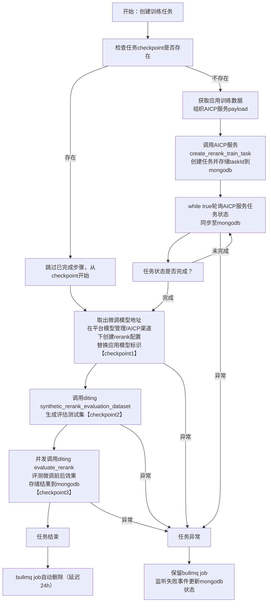

# Rerank 训练模块设计文档

本文档基于《智能客服RAG应用部署与优化全方案》中 7.1.2 和 7.1.3 的设计，结合 FastGPT 现有模块设计规范进行优化和细化。

备注：
- 生成训练数据集：《智能客服RAG应用部署与优化全方案》中打标数据转换为训练数据的流程不纳入本次版本开发设计中，只考虑从分片生成 Rerank 训练数据;

## 1. 设计原则与架构决策

### 1.1 核心设计原则

1. **YAGNI 原则**：只实现当前 Rerank 需求，不为未来可能的训练类型做过度抽象
2. **类型安全优先**：使用强类型数据模型，避免通用 JSON 存储导致的类型丢失
3. **两层架构**：知识库级训练集（内部缓存）+ 应用级训练集（对外暴露），职责分离
4. **数据拷贝复用**：应用训练集拷贝知识库训练集数据，解耦两层，支持独立修改
5. **权限复用**：应用训练集复用 App 权限，生成数据需 Dataset 读权限
6. **评测数据集复用**：训练任务的生成评测数据集复用评测数据集表
7. **符合现有风格**：参照 Dataset/App 模块的分层结构和命名规范


### 1.2 为什么采用两层架构？

**关键决策**：层级1知识库训练集（内部缓存） + 层级2应用训练集（对外暴露）

| 对比维度 | 单层扁平设计 | 两层架构设计 ⭐ |
|---------|------------|----------------|
| 职责分离 | ❌ 数据生成和使用混在一起 | ✅ 知识库负责生成、应用负责整合定制 |
| 数据复用 | ❌ 需重复生成相同知识库数据 | ✅ 知识库数据作为缓存，可被多个应用复用 |
| 关系清晰度 | ⚠️ N:N 关系较复杂 | ✅ 两个 1:1 关系更清晰 |
| 对话日志集成 | ⚠️ 与合成数据混在一起 | ✅ 应用级独立管理补充数据 |
| 更新解耦 | ❌ 知识库更新影响所有应用 | ✅ 应用可选择是否同步知识库更新 |
| 维护成本 | ✅ 简单 | ⚠️ 需维护两层（但更清晰） |

**设计要点**：
- **层级1（DatasetTrainset）**：知识库训练集，1:1 绑定知识库，仅内部使用，自动从知识库分片生成训练数据
- **层级2（RerankTrainset）**：应用训练集，1:1 绑定应用，对外暴露 API，拷贝知识库训练集数据 + 补充对话日志数据
- **数据拷贝而非引用**：降低复杂度，应用级操作（更新/删除）不影响知识库级数据
- **知识库训练集懒加载**：生成应用训练数据时，检查知识库训练集是否存在，不存在则自动创建并生成

---

## 2. 整体架构

### 2.1 架构图

```
┌────────────────────────────────────────────────────────────────┐
│             层级1：知识库训练集（内部缓存）                       │
├────────────────────────────────────────────────────────────────┤
│  Dataset (知识库)                                               │
│      ↓ 1:1                                                     │
│  DatasetTrainset (知识库训练集)                                 │
│      ↓ 1:N                                                     │
│  DatasetTrainsetData (基础训练数据)                             │
│      - 来源：DiTing 从知识库分片合成                             │
│      - 特点：自动生成、懒加载、可复用                            │
└────────────────────────────────────────────────────────────────┘
                           ↓ 数据拷贝
┌────────────────────────────────────────────────────────────────┐
│             层级2：应用训练集（对外暴露）                         │
├────────────────────────────────────────────────────────────────┤
│  App (应用)                                                     │
│      ↓ 1:1                                                     │
│  RerankTrainset (应用训练集)                                    │
│      ↓ 1:N                                                     │
│  RerankTrainsetData (应用训练数据)                              │
│      - 来源1：拷贝自 DatasetTrainsetData                        │
│      - 来源2：从对话日志转换                                     │
│      - 来源3：手动添加                                           │
│      - 特点：整合复用、场景定制、支持独立修改                     │
└────────────────────────────────────────────────────────────────┘
                           ↓ 1:N
                   RerankTrainTask (训练任务)
                           ↓
              ┌────────────┴────────────┐
              ↓                         ↓
      ┌──────────────┐         ┌──────────────┐
      │ DiTing 服务   │         │ AICP 服务     │
      │ (数据合成)    │         │ (模型训练)    │
      └──────────────┘         └──────────────┘
```

### 2.2 数据关系

```
层级1：知识库训练集（内部）
Dataset (知识库)
    ↓ 1:1
DatasetTrainset (知识库训练集)
    ↓ 1:N
DatasetTrainsetData (知识库训练数据)

层级2：应用训练集（对外）
App (应用)
    ↓ 1:1
RerankTrainset (应用训练集)
    ↓ 1:N
RerankTrainsetData (应用训练数据)
    - 拷贝自 DatasetTrainsetData（通过 datasetTrainsetDataId 记录溯源）
    - 或从对话日志/手动添加

App (应用)
    ↓ 1:N
RerankTrainTask (训练任务)
    - 使用应用的训练集（1:1 关系）
```

**关系说明**：
- **知识库与知识库训练集：1:1 关系**
  - 每个知识库对应唯一的训练集（自动生成）
  - 知识库训练集仅内部使用，不对外暴露API
- **应用与应用训练集：1:1 关系**
  - 每个应用对应唯一的训练集
  - 应用训练集对外暴露所有 CRUD API
- **数据拷贝机制**：
  - 应用训练集从知识库训练集**拷贝**数据，而非引用
  - 拷贝后数据独立，应用级修改不影响知识库级数据
  - 通过 `metadata.sourceInfo.datasetTrainsetDataId` 记录溯源
- **懒加载策略**：
  - 知识库训练集不主动创建
  - 生成应用训练数据时，检查知识库训练集是否存在
  - 不存在则自动创建并生成，存在则直接复用

### 2.3 目录结构

```
packages/global/core/train/
└── rerank/
    ├── type.d.ts              # Rerank 训练核心类型
    ├── constants.ts           # 常量和枚举
    └── api.d.ts               # API 请求/响应类型

packages/service/core/train/
└── rerank/
    ├── dataset_trainset/               # 层级1：知识库训练集（内部）
    │   ├── schema.ts                   # DatasetTrainset Schema
    │   ├── controller.ts               # 知识库训练集业务逻辑
    │   └── utils.ts                    # 内部工具函数
    ├── trainset/                       # 层级2：应用训练集（对外）
    │   ├── schema.ts                   # RerankTrainset Schema
    │   └── controller.ts               # 应用训练集业务逻辑
    ├── data/
    │   ├── schema.ts                   # RerankTrainsetData Schema
    │   └── controller.ts               # 应用训练数据业务逻辑
    └── task/
        ├── schema.ts                   # RerankTrainTask Schema
        ├── controller.ts               # 训练任务业务逻辑
        ├── mq.ts                       # BullMQ 队列配置
        └── processor.ts                # Worker 处理器

packages/service/support/permission/train/
└── rerank/
    └── auth.ts                         # Rerank 训练权限认证

projects/app/src/pages/api/core/train/
└── rerank/
    ├── trainset/                       # 应用训练集 API（对外）
    │   ├── create.ts
    │   ├── detail.ts
    │   ├── delete.ts
    │   └── data/                       # 应用训练数据 API
    │       ├── list.ts
    │       ├── generate.ts             # 生成训练数据（从知识库拷贝）
    │       ├── import-from-chat.ts     # 从对话日志导入
    │       ├── create.ts               # 手动添加
    │       ├── update.ts               # 更新训练数据
    │       └── delete.ts               # 删除训练数据
    └── task/                           # 训练任务 API
        ├── create.ts
        ├── list.ts
        ├── detail.ts
        ├── retry.ts
        ├── cancel.ts
        └── delete.ts
```

---

## 3. 数据模型设计

### 3.1 DatasetTrainset (知识库训练集) - 层级1

**集合名**: `dataset_trainsets`

**说明**：与知识库 1:1 绑定的训练集，仅内部使用，作为数据生成的缓存层。不对外暴露 API，通过内部函数自动创建和管理。

```typescript
type DatasetTrainsetSchemaType = {
  _id: string;
  datasetId: string;               // 1:1 关系，唯一索引
  teamId: string;

  name: string;                    // 自动生成：`${datasetName} - 训练集`

  // 统计信息
  dataCount: number;               // 训练数据总数

  // 状态
  status: DatasetTrainsetStatusEnum;  // idle | generating | ready | error
  errorMsg?: string;

  // 生成配置（记录用）
  generationConfig?: {
    sampleSize: number;
    queryCount: number;
    negativeCount: number;
    model: string;
  };

  createTime: Date;
  updateTime: Date;
};

enum DatasetTrainsetStatusEnum {
  idle = 'idle',                   // 空闲（无数据）
  generating = 'generating',       // 生成中
  ready = 'ready',                 // 就绪
  error = 'error'                  // 错误
}
```

**索引**：
- `{ datasetId: 1 }` - 唯一索引，保证 1:1 关系
- `{ teamId: 1, status: 1 }`
- `{ status: 1, updateTime: -1 }`

### 3.2 DatasetTrainsetData (知识库训练数据) - 层级1

**集合名**: `dataset_trainset_datas`

**说明**：存储从知识库分片生成的基础训练数据，作为应用训练集的数据源。

```typescript
type DatasetTrainsetDataSchemaType = {
  _id: string;
  trainsetId: string;              // 所属知识库训练集
  datasetId: string;               // 冗余，便于查询
  teamId: string;

  // Rerank 训练数据格式
  queries: string[];               // 查询变体
  positiveDocs: string[];          // 正样本文档
  negativeDocs: string[];          // 负样本文档

  // 元数据
  metadata: {
    dataIds: string[];             // 来源数据分片ID
    generationConfig: {
      model: string;
      temperature: number;
    };
    generatedAt: Date;
  };

  createTime: Date;
};
```

**索引**：
- `{ trainsetId: 1, createTime: -1 }`
- `{ datasetId: 1 }`
- `{ teamId: 1 }`

### 3.3 RerankTrainset (应用训练集) - 层级2

**集合名**: `rerank_trainsets`

**说明**：与应用 1:1 绑定的训练集，对外暴露 API。整合知识库训练数据并支持补充对话日志数据。

```typescript
type RerankTrainsetSchemaType = {
  _id: string;
  appId: string;                   // 1:1 关系，唯一索引
  teamId: string;
  tmbId: string;                   // 创建者

  name: string;                    // 自动生成：`${appName} - 训练集`
  description?: string;

  // 来源统计（记录数据来源分布）
  sourceSummary: Array<{
    type: 'dataset' | 'chat_log' | 'manual';
    datasetId?: string;
    datasetName?: string;
    count: number;
  }>;

  // 统计信息
  dataCount: number;               // 总数据量
  positiveCount: number;           // 正样本数
  negativeCount: number;           // 负样本数

  // 状态
  status: RerankTrainsetStatusEnum;  // idle | composing | ready | error
  errorMsg?: string;

  createTime: Date;
  updateTime: Date;
};

enum RerankTrainsetStatusEnum {
  idle = 'idle',                   // 空闲（无数据）
  composing = 'composing',         // 组装中（从知识库拷贝数据）
  ready = 'ready',                 // 就绪
  error = 'error'                  // 错误
}
```

**索引**：
- `{ appId: 1 }` - 唯一索引，保证 1:1 关系
- `{ teamId: 1, updateTime: -1 }`
- `{ status: 1 }`

### 3.4 RerankTrainsetData (应用训练数据) - 层级2

**集合名**: `rerank_trainset_datas`

**说明**：应用训练集的具体数据，来源于知识库训练集（拷贝）、对话日志或手动添加。

```typescript
type RerankTrainsetDataSchemaType = {
  _id: string;
  trainsetId: string;              // 所属应用训练集
  appId: string;                   // 冗余，便于查询和权限
  teamId: string;

  // Rerank 训练数据格式
  queries: string[];               // 查询变体
  positiveDocs: string[];          // 正样本文档
  negativeDocs: string[];          // 负样本文档

  // 数据来源
  source: TrainDataSourceEnum;     // dataset | chat_log | manual

  // 元数据
  metadata: {
    sourceInfo: {
      // 来自知识库（拷贝）
      datasetTrainsetDataId?: string;  // 溯源：原始知识库训练数据ID
      datasetId?: string;
      datasetName?: string;
      dataIds?: string[];                // 具体数据分片ID

      // 来自对话日志
      chatLogInfo?: {
        chatId: string;
        itemIds: string[];
      };

      // 手动添加
      manualInfo?: {
        creator: string;
        createdAt: Date;
        reason?: string;
      };
    };

    // 生成配置（如果来自知识库）
    generationConfig?: {
      model: string;
      temperature: number;
    };
  };

  createTime: Date;
};

enum TrainDataSourceEnum {
  dataset = 'dataset',             // 从知识库拷贝
  chat_log = 'chat_log',           // 从对话日志转换
  manual = 'manual'                // 手动添加
}
```

**索引**：
- `{ trainsetId: 1, createTime: -1 }`
- `{ appId: 1, createTime: -1 }`
- `{ teamId: 1 }`
- `{ source: 1 }`

### 3.5 RerankTrainTask (训练任务)

**集合名**: `rerank_train_tasks`

**说明**：管理 Rerank 模型训练任务的完整生命周期。每个任务使用应用的训练集（1:1关系）。

```typescript
type RerankTrainTaskSchemaType = {
  _id: string;
  appId: string;                   // 关联的应用
  teamId: string;
  tmbId: string;                   // 发起者

  name: string;                    // 任务名称

  // 任务状态
  status: RerankTrainTaskStatusEnum;

  // 检查点数据（用于断点续跑）
  checkpoint: {
    stage: RerankTaskCheckpointStageEnum | null;  // null 表示未开始
    data?: {
      // 阶段1: 数据准备
      preparing?: {
        trainDatasetIds: string[];
        trainDatasetFilePath: string;
      };

      // 阶段2: 模型微调
      finetuning?: {
        aicpTaskId: string;
        baseModelEndpoint: {
          ip: string;
          port: string;
          model: string;
          api_key: string;
        };
        tunedModelEndpoint: {
          ip: string;
          port: string;
          model: string;
          api_key: string;
        };
      };

      // 阶段3: 模型注册
      registering?: {
        baseModelConfigId: string;
        tunedModelConfigId: string;
      };

      // 阶段4: 效果评测（拆分为 4 个子步骤，支持细粒度断点续传）
      evaluating?: {
        baseModelEvalDatasetId?: string;     // 子步骤1: 基于基础模型-知识库搜索节点生成的评估测试集ID
        tunedModelEvalDatasetId?: string;    // 子步骤2: 基于微调模型-知识库搜索节点生成的评估测试集ID
        baseModelEvalResult?: Record<string, any>;   // 子步骤3: 基础模型评测结果
        tunedModelEvalResult?: Record<string, any>;  // 子步骤4: 微调模型评测结果
      };
    };
    stageStartTime?: {
      preparing?: Date;
      finetuning?: Date;
      registering?: Date;
      evaluating?: Date;
    };
  };

  // 训练结果（最终结果，用于展示）
  result?: {
    trainDatasetIds: string[];
    trainDatasetFilePath: string;
    baseModelConfigId: string;
    tunedModelConfigId: string;
    baseModelEvalDatasetId: string;
    tunedModelEvalDatasetId: string;
    baseModelEvalResult: Record<string, any>;
    tunedModelEvalResult: Record<string, any>;
  };

  // 错误信息
  errorMsg?: string;
  retryCount: number;              // 重试次数

  // BullMQ Job 信息
  jobId?: string;

  createTime: Date;
  updateTime: Date;
  finishTime?: Date;
};

enum RerankTrainTaskStatusEnum {
  pending = 'pending',
  running = 'running',              // 合并 preparing/finetuning/registering/evaluating
  completed = 'completed',
  failed = 'failed',
  cancelled = 'cancelled'
}

enum RerankTaskCheckpointStageEnum {
  preparing = 'preparing',
  finetuning = 'finetuning',      // 模型微调（AICP执行微调并自动部署到推理服务）
  registering = 'registering',    // 模型注册（在FastGPT中注册配置）
  evaluating = 'evaluating',
}
```

**索引**：
- `{ appId: 1, createTime: -1 }`
- `{ teamId: 1, status: 1 }`
- `{ status: 1, updateTime: 1 }`
- `{ jobId: 1 }`
- `{ 'checkpoint.stage': 1, status: 1 }`

---

## 4. 核心流程设计

### 4.1 知识库训练集自动生成（内部流程）

**触发时机**：应用训练集生成数据时，检测到知识库训练集不存在或状态为 error

**内部函数**：`ensureDatasetTrainset(datasetId)`

```typescript
// packages/service/core/train/rerank/dataset_trainset/controller.ts

/**
 * 确保知识库训练集存在且就绪（懒加载）
 * 内部函数，不对外暴露API
 */
export async function ensureDatasetTrainset(datasetId: string): Promise<DatasetTrainset> {
  // 1. 检查是否已存在
  let datasetTrainset = await MongoDatasetTrainset.findOne({ datasetId });

  if (!datasetTrainset) {
    // 2. 不存在则创建
    const dataset = await MongoDataset.findById(datasetId);
    if (!dataset) {
      throw new Error('Dataset not found');
    }

    const [{ _id }] = await MongoDatasetTrainset.create([{
      datasetId,
      teamId: dataset.teamId,
      name: `${dataset.name} - 训练集`,
      dataCount: 0,
      status: DatasetTrainsetStatusEnum.idle
    }]);

    datasetTrainset = await MongoDatasetTrainset.findById(_id);
  }

  // 3. 如果状态是 idle 或 error，则触发生成
  if (
    datasetTrainset.status === DatasetTrainsetStatusEnum.idle ||
    datasetTrainset.status === DatasetTrainsetStatusEnum.error
  ) {
    await generateDatasetTrainsetData(datasetTrainset._id);
  }

  // 4. 等待生成完成
  return await waitForDatasetTrainsetReady(datasetTrainset._id);
}

/**
 * 生成知识库训练数据（调用DiTing）
 * 内部函数
 */
async function generateDatasetTrainsetData(trainsetId: string) {
  const trainset = await MongoDatasetTrainset.findById(trainsetId);
  if (!trainset) throw new Error('Trainset not found');

  // 更新状态
  await MongoDatasetTrainset.updateOne(
    { _id: trainsetId },
    { status: DatasetTrainsetStatusEnum.generating }
  );

  try {
    // 从知识库采样分片
    const sampleData = await sampleDataFromDataset(trainset.datasetId, {
      sampleSize: 1000  // 默认采样大小
    });

    // 调用 DiTing 生成训练数据
    const generatedData = await callDiTingSyntheticRerankTrainData(sampleData);

    // 批量插入
    const insertData = generatedData.map(item => ({
      trainsetId,
      datasetId: trainset.datasetId,
      teamId: trainset.teamId,
      queries: item.queries,
      positiveDocs: item.positiveDocs,
      negativeDocs: item.negativeDocs,
      metadata: {
        dataIds: item.sourceDataIds,
        generationConfig: item.generationConfig,
        generatedAt: new Date()
      }
    }));

    await MongoDatasetTrainsetData.insertMany(insertData);

    // 更新状态
    await MongoDatasetTrainset.updateOne(
      { _id: trainsetId },
      {
        status: DatasetTrainsetStatusEnum.ready,
        dataCount: generatedData.length,
        generationConfig: {
          sampleSize: 1000,
          queryCount: 1,
          negativeCount: 10,
          model: 'diting-xxx'
        },
        errorMsg: null,
        updateTime: new Date()
      }
    );

  } catch (error) {
    await MongoDatasetTrainset.updateOne(
      { _id: trainsetId },
      {
        status: DatasetTrainsetStatusEnum.error,
        errorMsg: (error as Error).message,
        updateTime: new Date()
      }
    );
    throw error;
  }
}

/**
 * 等待知识库训练集就绪
 */
async function waitForDatasetTrainsetReady(
  trainsetId: string,
  timeout: number = 5 * 60 * 1000
): Promise<DatasetTrainset> {
  const startTime = Date.now();

  while (Date.now() - startTime < timeout) {
    const trainset = await MongoDatasetTrainset.findById(trainsetId);
    if (!trainset) throw new Error('Trainset not found');

    if (trainset.status === DatasetTrainsetStatusEnum.ready) {
      return trainset;
    }

    if (trainset.status === DatasetTrainsetStatusEnum.error) {
      throw new Error(`Dataset trainset generation failed: ${trainset.errorMsg}`);
    }

    // 等待 3 秒后重试
    await new Promise(resolve => setTimeout(resolve, 3000));
  }

  throw new Error('Dataset trainset generation timeout');
}
```

### 4.2 应用训练数据生成（从知识库拷贝）

**API**: `POST /api/core/train/rerank/trainset/data/generate`

**流程**：
1. 获取应用关联的知识库列表
2. 对每个知识库，确保知识库训练集存在并就绪（调用 `ensureDatasetTrainset`）
3. 从知识库训练集拷贝数据到应用训练集
4. 更新应用训练集统计信息

```typescript
// packages/service/core/train/rerank/trainset/controller.ts

export async function generateAppTrainsetData(params: {
  appId: string;
  trainsetId: string;
  datasetIds?: string[];     // 可选，默认使用应用关联的所有知识库
  sampleSize?: number;       // 每个知识库的采样大小
  forceRegenerate?: boolean;
}) {
  const { appId, trainsetId, sampleSize, forceRegenerate } = params;

  // 1. 获取应用
  const app = await MongoApp.findById(appId);
  if (!app) throw new Error('App not found');

  // 2. 确定目标知识库
  const targetDatasetIds = params.datasetIds?.length
    ? params.datasetIds
    : app.modules
        .filter(m => m.type === 'dataset')
        .map(m => m.datasetId)
        .filter(Boolean);

  if (!targetDatasetIds.length) {
    throw new Error('No datasets found for this app');
  }

  // 3. 更新应用训练集状态
  await MongoRerankTrainset.updateOne(
    { _id: trainsetId },
    { status: RerankTrainsetStatusEnum.composing }
  );

  try {
    // 4. 如果强制重新生成，先清空旧数据
    if (forceRegenerate) {
      await MongoRerankTrainsetData.deleteMany({ trainsetId });
    }

    // 5. 对每个知识库，确保训练集就绪并拷贝数据
    for (const datasetId of targetDatasetIds) {
      // 5.1 确保知识库训练集存在并就绪（懒加载）
      const datasetTrainset = await ensureDatasetTrainset(datasetId);

      // 5.2 获取知识库训练数据
      const datasetTrainData = await MongoDatasetTrainsetData.find({
        trainsetId: datasetTrainset._id
      }).lean();

      // 5.3 拷贝数据到应用训练集
      const appTrainData: RerankTrainsetData[] = datasetTrainData.map(data => ({
        trainsetId,
        appId,
        teamId: data.teamId,

        // 拷贝核心数据
        queries: [...data.queries],
        positiveDocs: [...data.positiveDocs],
        negativeDocs: [...data.negativeDocs],

        source: TrainDataSourceEnum.dataset,

        metadata: {
          sourceInfo: {
            datasetTrainsetDataId: String(data._id),  // 溯源
            datasetId: datasetId,
            datasetName: datasetTrainset.name.replace(' - 训练集', ''),
            dataIds: data.metadata.dataIds,
          },
          generationConfig: data.metadata.generationConfig,
        },

        createTime: new Date(),
      }));

      // 批量插入
      await MongoRerankTrainsetData.insertMany(appTrainData);
    }

    // 6. 更新应用训练集统计
    const stats = await calculateTrainsetStats(trainsetId);
    await MongoRerankTrainset.updateOne(
      { _id: trainsetId },
      {
        status: RerankTrainsetStatusEnum.ready,
        dataCount: stats.dataCount,
        positiveCount: stats.positiveCount,
        negativeCount: stats.negativeCount,
        sourceSummary: stats.sourceSummary,
        updateTime: new Date(),
        errorMsg: null
      }
    );

  } catch (error) {
    await MongoRerankTrainset.updateOne(
      { _id: trainsetId },
      {
        status: RerankTrainsetStatusEnum.error,
        errorMsg: (error as Error).message,
        updateTime: new Date()
      }
    );
    throw error;
  }
}
```

### 4.3 从对话日志补充数据【暂时不实现】

**API**: `POST /api/core/train/rerank/trainset/data/import-from-chat`

```typescript
export async function importFromChatLog(params: {
  trainsetId: string;
  appId: string;
  chatIds: string[];
}) {
  const { trainsetId, appId, chatIds } = params;

  // 1. 从对话记录提取训练样本
  const samples = await extractRerankSamplesFromChat(chatIds);

  // 2. 转换为训练数据
  const appTrainData: RerankTrainsetData[] = samples.map(sample => ({
    trainsetId,
    appId,
    teamId: sample.teamId,

    queries: sample.queries,
    positiveDocs: sample.positiveDocs,
    negativeDocs: sample.negativeDocs,

    source: TrainDataSourceEnum.chat_log,

    metadata: {
      sourceInfo: {
        chatLogInfo: {
          chatId: sample.chatId,
          itemIds: sample.itemIds,
        },
      },
    },

    createTime: new Date(),
  }));

  // 3. 批量插入
  await MongoRerankTrainsetData.insertMany(appTrainData);

  // 4. 更新统计
  await updateTrainsetStats(trainsetId);
}
```

### 4.4 获取应用基础模型配置

**用途**：训练任务的 finetuning 阶段需要获取当前应用使用的基础 rerank 模型配置，用于：
1. 记录 baseModelEndpoint 到 checkpoint（用于评测对比）
2. 获取 baseModelConfigId（用于注册微调模型时作为参照）

**内部函数**：`getAppBaseRerankModel(appId: string)`

```typescript
// packages/service/core/train/rerank/task/utils.ts

/**
 * 获取应用当前使用的基础 rerank 模型配置
 * 从应用工作流中提取 rerank 节点的模型配置
 */
export async function getAppBaseRerankModel(appId: string): Promise<{
  modelConfigId: string;
  endpoint: {
    ip: string;
    port: string;
    model: string;
    api_key: string;
  };
}> {
  // 1. 查询应用
  const app = await MongoApp.findById(appId);
  if (!app) {
    throw new Error('App not found');
  }

  // 2. 从工作流中查找 rerank 节点
  // 注意：rerank 可能在 rerankNode 或 datasetSearchNode 中
  const rerankNode = app.modules.find(
    m => m.flowNodeType === 'rerankNode' ||
         (m.flowNodeType === 'datasetSearchNode' && m.rerankConfig?.modelId)
  );

  if (!rerankNode) {
    throw new Error('Rerank node not found in app workflow');
  }

  // 3. 提取模型配置ID
  const modelConfigId = rerankNode.moduleId || rerankNode.rerankConfig?.modelId;
  if (!modelConfigId) {
    throw new Error('Rerank model config ID not found');
  }

  // 4. 查询模型配置表
  const modelConfig = await MongoAIModel.findById(modelConfigId);
  if (!modelConfig) {
    throw new Error('Rerank model config not found');
  }

  // 5. 解析 endpoint 信息
  const baseUrl = modelConfig.baseUrl || '';
  const urlWithoutProtocol = baseUrl.replace(/^https?:\/\//, '');
  const [ipPart, ...rest] = urlWithoutProtocol.split(':');
  const portAndPath = rest.join(':');
  const port = portAndPath?.split('/')[0] || '80';

  return {
    modelConfigId: String(modelConfig._id),
    endpoint: {
      ip: ipPart || 'localhost',
      port,
      model: modelConfig.model || 'bge-reranker-v2-m3',
      api_key: modelConfig.apiKey || ''
    }
  };
}
```

**调用时机**：
- 在训练任务的 `runFinetuneStage` 函数开始时调用
- 获取的 baseModelEndpoint 保存到 `checkpoint.data.finetuning.baseModelEndpoint`
- 获取的 modelConfigId 在 `runRegisterStage` 时作为 baseModelConfigId 保存

---

## 5. 权限设计

### 5.1 权限策略

| 资源 | 权限来源 | 说明 |
|-----|---------|------|
| DatasetTrainset | 内部使用 | 不对外暴露，无需权限认证 |
| RerankTrainset | App 权限 | 应用训练集复用 App 权限 |
| RerankTrainsetData | 继承训练集权限 | 继承所属应用训练集的权限 |
| RerankTrainTask | App 权限 | 训练任务复用 App 权限 |
| 从 Dataset 生成数据 | Dataset 读权限 | 生成应用训练数据时，需验证对应知识库的读权限 |

**设计理由**：
- 应用训练集与应用 1:1 绑定，自然复用 App 权限体系
- 生成训练数据时，如果从知识库拷贝，需要验证对应知识库的读权限
- 知识库训练集仅内部使用，不需要对外权限认证

### 5.2 权限认证函数

```typescript
// packages/service/support/permission/train/rerank/auth.ts

/**
 * Rerank 应用训练集权限认证 - 复用 App 权限
 */
export async function authRerankTrainset({
  trainsetId,
  per,
  ...props
}: AuthModeType & {
  trainsetId: string;
  per: PermissionValueType;
}) {
  const trainset = await MongoRerankTrainset.findById(trainsetId);
  if (!trainset) {
    return Promise.reject(RerankTrainErrEnum.trainsetNotExist);
  }

  // 复用应用权限
  const result = await authApp({
    ...props,
    appId: trainset.appId,
    per
  });

  return { ...result, trainset };
}

/**
 * 通过 appId 认证应用训练集权限
 */
export async function authRerankTrainsetByAppId({
  appId,
  per,
  ...props
}: AuthModeType & {
  appId: string;
  per: PermissionValueType;
}) {
  const trainset = await MongoRerankTrainset.findOne({ appId });
  if (!trainset) {
    return Promise.reject(RerankTrainErrEnum.trainsetNotExist);
  }

  const result = await authApp({
    ...props,
    appId,
    per
  });

  return { ...result, trainset };
}

/**
 * Rerank 训练任务权限认证 - 复用 App 权限
 */
export async function authRerankTrainTask({
  taskId,
  per,
  ...props
}: AuthModeType & {
  taskId: string;
  per: PermissionValueType;
}) {
  const task = await MongoRerankTrainTask.findById(taskId);
  if (!task) {
    return Promise.reject(RerankTrainErrEnum.taskNotExist);
  }

  const result = await authApp({
    ...props,
    appId: task.appId,
    per
  });

  return { ...result, task };
}

/**
 * 验证从知识库生成训练数据的权限
 */
export async function authGenerateFromDatasets({
  datasetIds,
  ...props
}: AuthModeType & {
  datasetIds: string[];
}) {
  // 验证每个知识库的读权限
  const datasets = await Promise.all(
    datasetIds.map(async (datasetId) => {
      const { dataset } = await authDataset({
        ...props,
        datasetId,
        per: ReadPermissionVal
      });
      return dataset;
    })
  );

  return { datasets };
}
```

### 5.3 操作权限要求

| 操作 | 资源 | 所需权限 |
|-----|------|---------|
| 创建应用训练集 | App | WritePermissionVal |
| 查看应用训练集 | App | ReadPermissionVal |
| 生成训练数据 | App + Dataset | App 写权限 + Dataset 读权限 |
| 删除训练数据 | App | WritePermissionVal |
| 删除应用训练集 | App | ManagePermissionVal |
| 创建训练任务 | App | WritePermissionVal |
| 查看训练任务 | App | ReadPermissionVal |
| 重试/取消任务 | App | WritePermissionVal |
| 删除训练任务 | App | ManagePermissionVal |

---

## 6. API 设计

**说明**：只暴露应用级训练集的 API，知识库训练集通过内部函数自动管理。

### 6.1 应用训练集 API

**基础路径**：`/api/core/train/rerank/trainset`

#### 6.1.1 创建应用训练集

```typescript
// POST /api/core/train/rerank/trainset/create
export type CreateTrainsetBody = {
  appId: string;                   // 必需：与应用 1:1 绑定
  name?: string;                   // 可选，默认：`${appName} - 训练集`
  description?: string;
};

async function handler(req: ApiRequestProps<CreateTrainsetBody>) {
  const { appId, name, description } = req.body;

  if (!appId) {
    return Promise.reject(CommonErrEnum.missingParams);
  }

  // 1. 认证应用写权限
  const { app, teamId, tmbId } = await authApp({
    req,
    authToken: true,
    appId,
    per: WritePermissionVal
  });

  // 2. 检查是否已存在（1:1 关系）
  const existingTrainset = await MongoRerankTrainset.findOne({ appId });
  if (existingTrainset) {
    return Promise.reject(RerankTrainErrEnum.trainsetAlreadyExist);
  }

  // 3. 创建应用训练集
  const [{ _id }] = await MongoRerankTrainset.create([{
    appId,
    teamId,
    tmbId,
    name: name || `${app.name} - 训练集`,
    description,
    sourceSummary: [],
    dataCount: 0,
    positiveCount: 0,
    negativeCount: 0,
    status: RerankTrainsetStatusEnum.idle
  }]);

  // 4. 审计日志
  (async () => {
    addAuditLog({
      tmbId,
      teamId,
      event: AuditEventEnum.CREATE_RERANK_TRAINSET,
      params: { appName: app.name, trainsetId: String(_id) }
    });
  })();

  return String(_id);
}

export default NextAPI(handler);
```

#### 6.1.2 应用训练集详情

```typescript
// GET /api/core/train/rerank/trainset/detail?trainsetId=xxx
export type RerankTrainsetDetailQuery = {
  trainsetId: string;
};

export type RerankTrainsetDetailResponse = RerankTrainsetSchemaType & {
  app: {
    _id: string;
    name: string;
    avatar: string;
  };
};

async function handler(
  req: ApiRequestProps<{}, RerankTrainsetDetailQuery>
): Promise<RerankTrainsetDetailResponse> {
  const { trainsetId } = req.query;

  if (!trainsetId) {
    return Promise.reject(CommonErrEnum.missingParams);
  }

  const { app, trainset } = await authRerankTrainset({
    req,
    authToken: true,
    trainsetId,
    per: ReadPermissionVal
  });

  return {
    ...trainset.toObject(),
    app: {
      _id: app._id,
      name: app.name,
      avatar: app.avatar
    }
  };
}

export default NextAPI(handler);
```

#### 6.1.3 删除应用训练集

```typescript
// DELETE /api/core/train/rerank/trainset/delete
export type DeleteRerankTrainsetQuery = {
  trainsetId: string;
};

async function handler(req: ApiRequestProps<{}, DeleteRerankTrainsetQuery>) {
  const { trainsetId } = req.query;

  if (!trainsetId) {
    return Promise.reject(CommonErrEnum.missingParams);
  }

  const { trainset, teamId, tmbId } = await authRerankTrainset({
    req,
    authToken: true,
    trainsetId,
    per: ManagePermissionVal
  });

  // 检查是否有进行中的任务
  const runningTask = await MongoRerankTrainTask.findOne({
    appId: trainset.appId,
    status: {
      $in: [
        RerankTrainTaskStatusEnum.pending,
        RerankTrainTaskStatusEnum.running
      ]
    }
  });
  if (runningTask) {
    return Promise.reject(RerankTrainErrEnum.trainsetInUse);
  }

  // 级联删除
  await mongoSessionRun(async (session) => {
    await MongoRerankTrainsetData.deleteMany({ trainsetId }, { session });
    await MongoRerankTrainset.deleteOne({ _id: trainsetId }, { session });
  });

  // 审计日志
  (async () => {
    addAuditLog({
      tmbId,
      teamId,
      event: AuditEventEnum.DELETE_RERANK_TRAINSET,
      params: { trainsetName: trainset.name }
    });
  })();

  return 'success';
}

export default NextAPI(handler);
```

### 6.2 应用训练数据 API

**基础路径**：`/api/core/train/rerank/trainset/data`

#### 6.2.1 生成训练数据（从知识库拷贝）

```typescript
// POST /api/core/train/rerank/trainset/data/generate
export type GenerateRerankTrainDataBody = {
  appId: string;                   // 必需：应用ID
  datasetIds?: string[];           // 可选：指定知识库，默认使用应用关联的所有知识库
  sampleSize?: number;             // 可选：每个知识库的采样大小，默认 1000
  forceRegenerate?: boolean;       // 可选：强制重新生成
};

export type GenerateRerankTrainDataResponse = {
  jobId: string;
  status: 'pending';
};

async function handler(
  req: ApiRequestProps<GenerateRerankTrainDataBody>
): Promise<GenerateRerankTrainDataResponse> {
  const { appId, datasetIds, sampleSize = 1000, forceRegenerate = false } = req.body;

  if (!appId) {
    return Promise.reject(CommonErrEnum.missingParams);
  }

  // 1. 认证应用写权限
  const { app, trainset, teamId, tmbId } = await authRerankTrainsetByAppId({
    req,
    authToken: true,
    appId,
    per: WritePermissionVal
  });

  // 2. 确定目标知识库
  const targetDatasetIds = datasetIds?.length
    ? datasetIds
    : app.modules
        .filter(m => m.type === 'dataset')
        .map(m => m.datasetId)
        .filter(Boolean);

  if (!targetDatasetIds.length) {
    return Promise.reject(RerankTrainErrEnum.noDatasetAvailable);
  }

  // 3. 认证知识库读权限
  const { datasets } = await authGenerateFromDatasets({
    req,
    authToken: true,
    datasetIds: targetDatasetIds
  });

  // 4. 检查状态
  if (trainset.status === RerankTrainsetStatusEnum.composing) {
    return Promise.reject(RerankTrainErrEnum.trainsetGenerating);
  }

  // 5. 创建异步任务
  const job = await rerankTrainDataGenerateQueue.add(
    `generate-${trainset._id}-${Date.now()}`,
    {
      appId,
      trainsetId: String(trainset._id),
      datasetIds: targetDatasetIds,
      datasetNames: datasets.map(d => d.name),
      teamId,
      tmbId,
      sampleSize: Math.min(sampleSize, 5000),
      forceRegenerate,
    },
    {
      attempts: 3,
      backoff: { type: 'exponential', delay: 5000 },
      removeOnComplete: { age: 24 * 60 * 60 }
    }
  );

  return {
    jobId: job.id as string,
    status: 'pending',
  };
}

export default NextAPI(handler);
```

#### 6.2.2 从对话日志导入

```typescript
// POST /api/core/train/rerank/trainset/data/import-from-chat
export type ImportFromChatBody = {
  appId: string;
  chatIds: string[];
};

async function handler(req: ApiRequestProps<ImportFromChatBody>) {
  const { appId, chatIds } = req.body;

  if (!appId || !chatIds?.length) {
    return Promise.reject(CommonErrEnum.missingParams);
  }

  const { trainset, teamId, tmbId } = await authRerankTrainsetByAppId({
    req,
    authToken: true,
    appId,
    per: WritePermissionVal
  });

  // 导入数据
  await importFromChatLog({
    trainsetId: String(trainset._id),
    appId,
    chatIds
  });

  return { success: true };
}

export default NextAPI(handler);
```

#### 6.2.3 手动添加训练数据

```typescript
// POST /api/core/train/rerank/trainset/data/create
export type CreateTrainDataBody = {
  appId: string;
  queries: string[];
  positiveDocs: string[];
  negativeDocs: string[];
  reason?: string;                 // 添加原因
};

async function handler(req: ApiRequestProps<CreateTrainDataBody>) {
  const { appId, queries, positiveDocs, negativeDocs, reason } = req.body;

  if (!appId || !queries?.length || !positiveDocs?.length || !negativeDocs?.length) {
    return Promise.reject(CommonErrEnum.missingParams);
  }

  const { trainset, teamId, tmbId } = await authRerankTrainsetByAppId({
    req,
    authToken: true,
    appId,
    per: WritePermissionVal
  });

  // 插入数据
  const [{ _id }] = await MongoRerankTrainsetData.create([{
    trainsetId: trainset._id,
    appId,
    teamId,
    queries,
    positiveDocs,
    negativeDocs,
    source: TrainDataSourceEnum.manual,
    metadata: {
      sourceInfo: {
        manualInfo: {
          creator: tmbId,
          createdAt: new Date(),
          reason
        }
      }
    }
  }]);

  // 更新统计
  await updateTrainsetStats(String(trainset._id));

  return String(_id);
}

export default NextAPI(handler);
```

#### 6.2.4 更新训练数据

```typescript
// PUT /api/core/train/rerank/trainset/data/update
export type UpdateTrainDataBody = {
  dataId: string;
  queries?: string[];
  positiveDocs?: string[];
  negativeDocs?: string[];
};

async function handler(req: ApiRequestProps<UpdateTrainDataBody>) {
  const { dataId, queries, positiveDocs, negativeDocs } = req.body;

  if (!dataId) {
    return Promise.reject(CommonErrEnum.missingParams);
  }

  // 获取数据
  const data = await MongoRerankTrainsetData.findById(dataId);
  if (!data) {
    return Promise.reject(RerankTrainErrEnum.trainDataNotExist);
  }

  // 认证权限
  await authRerankTrainsetByAppId({
    req,
    authToken: true,
    appId: data.appId,
    per: WritePermissionVal
  });

  // 更新
  const updateFields: any = { updateTime: new Date() };
  if (queries) updateFields.queries = queries;
  if (positiveDocs) updateFields.positiveDocs = positiveDocs;
  if (negativeDocs) updateFields.negativeDocs = negativeDocs;

  await MongoRerankTrainsetData.updateOne({ _id: dataId }, updateFields);

  return 'success';
}

export default NextAPI(handler);
```

#### 6.2.5 训练数据列表

```typescript
// POST /api/core/train/rerank/trainset/data/list
export type ListTrainDataBody = PaginationProps<{
  appId: string;
  source?: TrainDataSourceEnum;
}>;

export type ListTrainDataResponse = PaginationResponse<RerankTrainsetDataSchemaType>;

async function handler(req: ApiRequestProps<ListTrainDataBody>) {
  const { appId, source, pageNum = 1, pageSize = 20 } = req.body;

  if (!appId) {
    return Promise.reject(CommonErrEnum.missingParams);
  }

  const { trainset } = await authRerankTrainsetByAppId({
    req,
    authToken: true,
    appId,
    per: ReadPermissionVal
  });

  const query: any = { trainsetId: trainset._id };
  if (source) query.source = source;

  const [list, total] = await Promise.all([
    MongoRerankTrainsetData.find(query)
      .sort({ createTime: -1 })
      .skip((pageNum - 1) * pageSize)
      .limit(pageSize)
      .lean(),
    MongoRerankTrainsetData.countDocuments(query)
  ]);

  return { list, total };
}

export default NextAPI(handler);
```

#### 6.2.6 删除训练数据

```typescript
// DELETE /api/core/train/rerank/trainset/data/delete
export type DeleteRerankTrainDataBody = {
  dataIds: string[];
};

async function handler(req: ApiRequestProps<DeleteRerankTrainDataBody>) {
  const { dataIds } = req.body;

  if (!dataIds?.length) {
    return Promise.reject(CommonErrEnum.missingParams);
  }

  // 获取第一条数据
  const firstData = await MongoRerankTrainsetData.findById(dataIds[0]);
  if (!firstData) {
    return Promise.reject(RerankTrainErrEnum.trainDataNotExist);
  }

  // 认证权限
  await authRerankTrainsetByAppId({
    req,
    authToken: true,
    appId: firstData.appId,
    per: WritePermissionVal
  });

  // 批量删除
  const result = await MongoRerankTrainsetData.deleteMany({
    _id: { $in: dataIds },
    trainsetId: firstData.trainsetId
  });

  // 更新统计
  await updateTrainsetStats(String(firstData.trainsetId));

  return { deletedCount: result.deletedCount };
}

export default NextAPI(handler);
```

### 6.3 训练任务 API

**基础路径**：`/api/core/train/rerank/task`

#### 6.3.1 创建训练任务

```typescript
// POST /api/core/train/rerank/task/create
export type CreateRerankTrainTaskBody = {
  appId: string;
  name?: string;
};

export type CreateRerankTrainTaskResponse = {
  taskId: string;
  status: RerankTrainTaskStatusEnum;
};

async function handler(
  req: ApiRequestProps<CreateRerankTrainTaskBody>
): Promise<CreateRerankTrainTaskResponse> {
  const { appId, name } = req.body;

  if (!appId) {
    return Promise.reject(CommonErrEnum.missingParams);
  }

  // 1. 认证应用写权限
  const { app, teamId, tmbId } = await authApp({
    req,
    authToken: true,
    appId,
    per: WritePermissionVal
  });

  // 2. 检查应用训练集是否存在且就绪
  const trainset = await MongoRerankTrainset.findOne({ appId });
  if (!trainset) {
    return Promise.reject(RerankTrainErrEnum.trainsetNotExist);
  }
  if (trainset.status !== RerankTrainsetStatusEnum.ready) {
    return Promise.reject(RerankTrainErrEnum.trainsetNotReady);
  }
  if (trainset.dataCount === 0) {
    return Promise.reject(RerankTrainErrEnum.noTrainDataAvailable);
  }

  // 3. 检查是否有进行中的任务
  const runningTask = await MongoRerankTrainTask.findOne({
    appId,
    status: {
      $in: [
        RerankTrainTaskStatusEnum.pending,
        RerankTrainTaskStatusEnum.running
      ]
    }
  });
  if (runningTask) {
    return Promise.reject(RerankTrainErrEnum.taskAlreadyRunning);
  }

  // 4. 创建任务
  const [{ _id: taskId }] = await MongoRerankTrainTask.create([{
    appId,
    teamId,
    tmbId,
    name: name || `Rerank训练-${new Date().toLocaleDateString()}`,
    status: RerankTrainTaskStatusEnum.pending,
    checkpoint: {
      stage: null,
      data: undefined,
      stageStartTime: undefined
    },
    retryCount: 0
  }]);

  // 5. 加入任务队列
  const job = await rerankTrainTaskQueue.add(
    `train-${taskId}`,
    { taskId: String(taskId), teamId, tmbId },
    {
      attempts: 3,
      backoff: { type: 'exponential', delay: 5000 },
      removeOnComplete: { age: 7 * 24 * 60 * 60 },
      removeOnFail: false
    }
  );

  // 6. 更新 jobId
  await MongoRerankTrainTask.updateOne({ _id: taskId }, { jobId: job.id as string });

  // 7. 审计日志
  (async () => {
    addAuditLog({
      tmbId,
      teamId,
      event: AuditEventEnum.CREATE_RERANK_TRAIN_TASK,
      params: { appName: app.name, taskId: String(taskId) }
    });
  })();

  return {
    taskId: String(taskId),
    status: RerankTrainTaskStatusEnum.pending
  };
}

export default NextAPI(handler);
```

#### 6.3.2 训练任务详情

```typescript
// GET /api/core/train/rerank/task/detail?taskId=xxx
export type RerankTrainTaskDetailQuery = {
  taskId: string;
};

export type RerankTrainTaskDetailResponse = RerankTrainTaskSchemaType & {
  app: {
    _id: string;
    name: string;
    avatar: string;
  };
};

async function handler(
  req: ApiRequestProps<{}, RerankTrainTaskDetailQuery>
): Promise<RerankTrainTaskDetailResponse> {
  const { taskId } = req.query;

  if (!taskId) {
    return Promise.reject(CommonErrEnum.missingParams);
  }

  const { task, app } = await authRerankTrainTask({
    req,
    authToken: true,
    taskId,
    per: ReadPermissionVal
  });

  return {
    ...task.toObject(),
    app: {
      _id: app._id,
      name: app.name,
      avatar: app.avatar
    }
  };
}

export default NextAPI(handler);
```

#### 6.3.3 训练任务列表

```typescript
// POST /api/core/train/rerank/task/list
export type ListRerankTrainTaskBody = PaginationProps<{
  appId?: string;
  status?: RerankTrainTaskStatusEnum;
}>;

export type ListRerankTrainTaskResponse = PaginationResponse<
  RerankTrainTaskSchemaType & {
    appName: string;
    appAvatar: string;
  }
>;

async function handler(
  req: ApiRequestProps<ListRerankTrainTaskBody>
): Promise<ListRerankTrainTaskResponse> {
  const { appId, status, pageNum = 1, pageSize = 20 } = req.body;

  const { teamId } = await authUserPer({
    req,
    authToken: true,
    per: ReadPermissionVal
  });

  const query: any = { teamId };
  if (appId) {
    await authApp({
      req,
      authToken: true,
      appId,
      per: ReadPermissionVal
    });
    query.appId = appId;
  }
  if (status) {
    query.status = status;
  }

  const [list, total] = await Promise.all([
    MongoRerankTrainTask.aggregate([
      { $match: query },
      { $sort: { createTime: -1 } },
      { $skip: (pageNum - 1) * pageSize },
      { $limit: pageSize },
      {
        $lookup: {
          from: 'apps',
          localField: 'appId',
          foreignField: '_id',
          as: 'app'
        }
      },
      { $unwind: '$app' },
      {
        $project: {
          _id: 1,
          appId: 1,
          name: 1,
          status: 1,
          result: 1,
          errorMsg: 1,
          retryCount: 1,
          createTime: 1,
          updateTime: 1,
          finishTime: 1,
          appName: '$app.name',
          appAvatar: '$app.avatar'
        }
      }
    ]),
    MongoRerankTrainTask.countDocuments(query)
  ]);

  return { list, total };
}

export default NextAPI(handler);
```

#### 6.3.4 重试训练任务

```typescript
// POST /api/core/train/rerank/task/retry
export type RetryRerankTrainTaskBody = {
  taskId: string;
};

async function handler(req: ApiRequestProps<RetryRerankTrainTaskBody>) {
  const { taskId } = req.body;

  if (!taskId) {
    return Promise.reject(CommonErrEnum.missingParams);
  }

  const { task, teamId, tmbId } = await authRerankTrainTask({
    req,
    authToken: true,
    taskId,
    per: WritePermissionVal
  });

  if (task.status !== RerankTrainTaskStatusEnum.failed) {
    return Promise.reject(RerankTrainErrEnum.taskCannotRetry);
  }

  if (task.retryCount >= 3) {
    return Promise.reject(RerankTrainErrEnum.taskRetryExceeded);
  }

  await MongoRerankTrainTask.updateOne(
    { _id: taskId },
    {
      status: RerankTrainTaskStatusEnum.pending,
      errorMsg: null,
      $inc: { retryCount: 1 },
      updateTime: new Date()
    }
  );

  const job = await rerankTrainTaskQueue.add(
    `train-${taskId}-retry-${Date.now()}`,
    { taskId, teamId, tmbId, isRetry: true },
    {
      attempts: 3,
      backoff: { type: 'exponential', delay: 5000 }
    }
  );

  await MongoRerankTrainTask.updateOne({ _id: taskId }, { jobId: job.id as string });

  return {
    taskId,
    status: RerankTrainTaskStatusEnum.pending
  };
}

export default NextAPI(handler);
```

#### 6.3.5 取消训练任务

```typescript
// POST /api/core/train/rerank/task/cancel
export type CancelRerankTrainTaskBody = {
  taskId: string;
};

async function handler(req: ApiRequestProps<CancelRerankTrainTaskBody>) {
  const { taskId } = req.body;

  if (!taskId) {
    return Promise.reject(CommonErrEnum.missingParams);
  }

  const { task } = await authRerankTrainTask({
    req,
    authToken: true,
    taskId,
    per: WritePermissionVal
  });

  const cancellableStatuses = [
    RerankTrainTaskStatusEnum.pending,
    RerankTrainTaskStatusEnum.running
  ];
  if (!cancellableStatuses.includes(task.status)) {
    return Promise.reject(RerankTrainErrEnum.taskCannotCancel);
  }

  // 取消 BullMQ Job
  if (task.jobId) {
    const job = await rerankTrainTaskQueue.getJob(task.jobId);
    if (job) {
      await job.remove();
    }
  }

  // 如果正在 AICP 服务微调，尝试取消
  if (
    task.checkpoint.stage === RerankTaskCheckpointStageEnum.finetuning &&
    task.checkpoint.data?.finetuning?.aicpTaskId
  ) {
    try {
      await cancelExternalTrainTask(task.checkpoint.data.finetuning.aicpTaskId);
    } catch (e) {
      addLog.warn('Cancel external train task failed', e);
    }
  }

  await MongoRerankTrainTask.updateOne(
    { _id: taskId },
    {
      status: RerankTrainTaskStatusEnum.cancelled,
      updateTime: new Date(),
      finishTime: new Date()
    }
  );

  return {
    taskId,
    status: RerankTrainTaskStatusEnum.cancelled
  };
}

export default NextAPI(handler);
```

#### 6.3.6 删除训练任务

```typescript
// DELETE /api/core/train/rerank/task/delete
export type DeleteRerankTrainTaskQuery = {
  taskId: string;
};

async function handler(req: ApiRequestProps<{}, DeleteRerankTrainTaskQuery>) {
  const { taskId } = req.query;

  if (!taskId) {
    return Promise.reject(CommonErrEnum.missingParams);
  }

  const { task, teamId, tmbId } = await authRerankTrainTask({
    req,
    authToken: true,
    taskId,
    per: ManagePermissionVal
  });

  const runningStatuses = [
    RerankTrainTaskStatusEnum.pending,
    RerankTrainTaskStatusEnum.running
  ];
  if (runningStatuses.includes(task.status)) {
    return Promise.reject(RerankTrainErrEnum.taskCannotDelete);
  }

  await MongoRerankTrainTask.deleteOne({ _id: taskId });

  (async () => {
    addAuditLog({
      tmbId,
      teamId,
      event: AuditEventEnum.DELETE_RERANK_TRAIN_TASK,
      params: { taskName: task.name }
    });
  })();

  return 'success';
}

export default NextAPI(handler);
```

---

## 7. 任务队列设计

### 7.1 队列配置

```typescript
// packages/service/core/train/rerank/task/mq.ts

export const RerankTrainQueueNames = {
  trainDataGenerate: 'rerankTrainDataGenerate',
  trainTask: 'rerankTrainTask'
} as const;

// 训练数据生成队列
export const rerankTrainDataGenerateQueue = getQueue<RerankTrainDataGenerateJobData>(
  RerankTrainQueueNames.trainDataGenerate,
  {
    defaultJobOptions: {
      attempts: 3,
      backoff: { type: 'exponential', delay: 2000 },
      removeOnComplete: { age: 24 * 60 * 60 },
      removeOnFail: { age: 7 * 24 * 60 * 60 }
    }
  }
);

// 训练任务队列
export const rerankTrainTaskQueue = getQueue<RerankTrainTaskJobData>(
  RerankTrainQueueNames.trainTask,
  {
    defaultJobOptions: {
      attempts: 3,
      backoff: { type: 'exponential', delay: 5000 },
      removeOnComplete: { age: 7 * 24 * 60 * 60 },
      removeOnFail: false
    }
  }
);

type RerankTrainDataGenerateJobData = {
  appId: string;
  trainsetId: string;
  datasetIds: string[];
  datasetNames: string[];
  teamId: string;
  tmbId: string;
  sampleSize: number;
  forceRegenerate: boolean;
};

type RerankTrainTaskJobData = {
  taskId: string;
  teamId: string;
  tmbId: string;
  isRetry?: boolean;
};
```

### 7.2 训练数据生成处理器

```typescript
// packages/service/core/train/rerank/task/dataGenerateProcessor.ts

export const rerankTrainDataGenerateProcessor: Processor<RerankTrainDataGenerateJobData> = async (job) => {
  const { appId, trainsetId, datasetIds, datasetNames, sampleSize, forceRegenerate } = job.data;

  try {
    // 调用核心生成函数
    await generateAppTrainsetData({
      appId,
      trainsetId,
      datasetIds,
      sampleSize,
      forceRegenerate
    });

    addLog.info(`Rerank app train data generation completed: ${trainsetId}`, {
      datasetCount: datasetIds.length
    });

  } catch (error) {
    // 更新失败状态
    await MongoRerankTrainset.updateOne(
      { _id: trainsetId },
      {
        status: RerankTrainsetStatusEnum.error,
        errorMsg: (error as Error).message,
        updateTime: new Date()
      }
    );

    throw error;
  }
};
```

### 7.3 训练任务处理器

#### 7.3.1 核心流程（bullmq异步任务）



#### 7.3.2 训练任务处理器代码

```typescript
// packages/service/core/train/rerank/task/processor.ts

export const rerankTrainTaskProcessor: Processor<RerankTrainTaskJobData> = async (job) => {
  const { taskId, isRetry } = job.data;

  const task = await MongoRerankTrainTask.findById(taskId);
  if (!task) {
    throw new UnrecoverableError('Task not found');
  }

  const currentStage = isRetry && task.checkpoint.stage !== null
    ? task.checkpoint.stage
    : null;

  try {
    if (task.status === RerankTrainTaskStatusEnum.pending) {
      await updateTaskStatus(taskId, RerankTrainTaskStatusEnum.running);
    }

    // 阶段1: 数据准备
    if (shouldRunStage(currentStage, RerankTaskCheckpointStageEnum.preparing)) {
      await updateCheckpointStage(taskId, RerankTaskCheckpointStageEnum.preparing);
      const prepareResult = await runPrepareStage(task);
      await MongoRerankTrainTask.updateOne(
        { _id: taskId },
        {
          'checkpoint.data.preparing': {
            trainDatasetIds: prepareResult.trainDatasetIds,
            trainDatasetFilePath: prepareResult.trainDatasetFilePath
          }
        }
      );
    }

    // 阶段2: 模型微调（AICP执行微调并自动部署到推理服务）
    if (shouldRunStage(currentStage, RerankTaskCheckpointStageEnum.finetuning)) {
      await updateCheckpointStage(taskId, RerankTaskCheckpointStageEnum.finetuning);
      const finetuneResult = await runFinetuneStage(task);
      await MongoRerankTrainTask.updateOne(
        { _id: taskId },
        {
          'checkpoint.data.finetuning': {
            aicpTaskId: finetuneResult.aicpTaskId,
            baseModelEndpoint: finetuneResult.baseModelEndpoint,
            tunedModelEndpoint: finetuneResult.tunedModelEndpoint
          }
        }
      );
    }

    // 阶段3: 模型注册（在FastGPT中注册配置）
    if (shouldRunStage(currentStage, RerankTaskCheckpointStageEnum.registering)) {
      await updateCheckpointStage(taskId, RerankTaskCheckpointStageEnum.registering);
      const registerResult = await runRegisterStage(task);
      await MongoRerankTrainTask.updateOne(
        { _id: taskId },
        {
          'checkpoint.data.registering': {
            baseModelConfigId: registerResult.baseModelConfigId,
            tunedModelConfigId: registerResult.tunedModelConfigId
          }
        }
      );
    }

    // 阶段4: 效果评测（拆分为 4 个子步骤，支持断点续传）
    if (shouldRunStage(currentStage, RerankTaskCheckpointStageEnum.evaluating)) {
      await updateCheckpointStage(taskId, RerankTaskCheckpointStageEnum.evaluating);

      const checkpointData = task.checkpoint.data || {};
      const evaluatingData = checkpointData.evaluating || {};

      // 验证注册阶段数据
      if (!checkpointData.registering?.baseModelConfigId || !checkpointData.registering?.tunedModelConfigId) {
        throw new UnrecoverableError('Model config IDs not found in checkpoint');
      }

      // 子步骤1: 生成基础模型评测数据集（如果未生成）
      if (!evaluatingData.baseModelEvalDatasetId) {
        const baseEvalDatasetId = await runGenerateBaseEvalDataset(task);
        await updateCheckpointData(taskId, 'evaluating', { baseModelEvalDatasetId }, true);
        evaluatingData.baseModelEvalDatasetId = baseEvalDatasetId;
      }

      // 子步骤2: 生成微调模型评测数据集（如果未生成）
      if (!evaluatingData.tunedModelEvalDatasetId) {
        const tunedEvalDatasetId = await runGenerateTunedEvalDataset(task);
        await updateCheckpointData(taskId, 'evaluating', { tunedModelEvalDatasetId }, true);
        evaluatingData.tunedModelEvalDatasetId = tunedEvalDatasetId;
      }

      // 子步骤3: 获取基础模型评测结果（如果未评测）
      if (!evaluatingData.baseModelEvalResult) {
        const baseModelEvalResult = await runEvaluateBaseModel(
          task,
          evaluatingData.baseModelEvalDatasetId!,
          checkpointData.registering.baseModelConfigId
        );
        await updateCheckpointData(taskId, 'evaluating', { baseModelEvalResult }, true);
        evaluatingData.baseModelEvalResult = baseModelEvalResult;
      }

      // 子步骤4: 获取微调模型评测结果（如果未评测）
      if (!evaluatingData.tunedModelEvalResult) {
        const tunedModelEvalResult = await runEvaluateTunedModel(
          task,
          evaluatingData.tunedModelEvalDatasetId!,
          checkpointData.registering.tunedModelConfigId
        );
        await updateCheckpointData(taskId, 'evaluating', { tunedModelEvalResult }, true);
        evaluatingData.tunedModelEvalResult = tunedModelEvalResult;
      }

      // 保存最终结果
      await MongoRerankTrainTask.updateOne(
        { _id: taskId },
        {
          result: {
            trainDatasetIds: checkpointData.preparing?.trainDatasetIds || [],
            trainDatasetFilePath: checkpointData.preparing?.trainDatasetFilePath || '',
            baseModelConfigId: checkpointData.registering?.baseModelConfigId || '',
            tunedModelConfigId: checkpointData.registering?.tunedModelConfigId || '',
            baseModelEvalDatasetId: evaluatingData.baseModelEvalDatasetId!,
            tunedModelEvalDatasetId: evaluatingData.tunedModelEvalDatasetId!,
            baseModelEvalResult: evaluatingData.baseModelEvalResult!,
            tunedModelEvalResult: evaluatingData.tunedModelEvalResult!
          }
        }
      );
    }

    await MongoRerankTrainTask.updateOne(
      { _id: taskId },
      {
        status: RerankTrainTaskStatusEnum.completed,
        finishTime: new Date(),
        updateTime: new Date()
      }
    );

    addLog.info(`Rerank train task completed: ${taskId}`);

  } catch (error) {
    if (error instanceof UnrecoverableError) {
      await MongoRerankTrainTask.updateOne(
        { _id: taskId },
        {
          status: RerankTrainTaskStatusEnum.failed,
          errorMsg: (error as Error).message,
          updateTime: new Date()
        }
      );
      throw error;
    }
    throw error;
  }
};

function shouldRunStage(
  currentStage: RerankTaskCheckpointStageEnum | null,
  targetStage: RerankTaskCheckpointStageEnum
): boolean {
  if (currentStage === null) return true;
  const stageOrder: RerankTaskCheckpointStageEnum[] = [
    RerankTaskCheckpointStageEnum.preparing,
    RerankTaskCheckpointStageEnum.finetuning,
    RerankTaskCheckpointStageEnum.registering,
    RerankTaskCheckpointStageEnum.evaluating,
  ];
  return stageOrder.indexOf(targetStage) >= stageOrder.indexOf(currentStage);
}
```

---

## 8. 级联删除设计

### 8.1 应用删除时

```typescript
// 在 app/del.ts 中添加
await mongoSessionRun(async (session) => {
  // ... 原有删除逻辑

  // 1. 取消进行中的训练任务
  const runningTasks = await MongoRerankTrainTask.find({
    appId: { $in: appIds },
    status: {
      $in: [
        RerankTrainTaskStatusEnum.pending,
        RerankTrainTaskStatusEnum.running
      ]
    }
  }, null, { session });

  for (const task of runningTasks) {
    if (task.jobId) {
      const job = await rerankTrainTaskQueue.getJob(task.jobId);
      if (job) await job.remove();
    }
  }

  // 2. 删除所有训练任务
  await MongoRerankTrainTask.deleteMany({ appId: { $in: appIds } }, { session });

  // 3. 删除应用训练数据
  await MongoRerankTrainsetData.deleteMany({ appId: { $in: appIds } }, { session });

  // 4. 删除应用训练集
  await MongoRerankTrainset.deleteMany({ appId: { $in: appIds } }, { session });
});
```

### 8.2 知识库删除时

```typescript
// 在 dataset/del.ts 中添加
await mongoSessionRun(async (session) => {
  // ... 原有删除逻辑

  // 删除知识库训练数据
  await MongoDatasetTrainsetData.deleteMany({ datasetId: { $in: datasetIds } }, { session });

  // 删除知识库训练集
  await MongoDatasetTrainset.deleteMany({ datasetId: { $in: datasetIds } }, { session });
});
```

---

## 9. 错误码定义

```typescript
// packages/global/common/error/code/train.ts

export enum RerankTrainErrEnum {
  // 应用训练集错误
  trainsetNotExist = 'trainsetNotExist',
  trainsetAlreadyExist = 'trainsetAlreadyExist',  // 应用已有训练集（1:1关系）
  trainsetGenerating = 'trainsetGenerating',
  trainsetAlreadyReady = 'trainsetAlreadyReady',
  trainsetNotReady = 'trainsetNotReady',
  trainsetInUse = 'trainsetInUse',

  // 训练数据错误
  trainDataNotExist = 'trainDataNotExist',
  noTrainDataAvailable = 'noTrainDataAvailable',
  noDatasetAvailable = 'noDatasetAvailable',

  // 训练任务错误
  taskNotExist = 'taskNotExist',
  taskAlreadyRunning = 'taskAlreadyRunning',
  taskCannotRetry = 'taskCannotRetry',
  taskRetryExceeded = 'taskRetryExceeded',
  taskCannotCancel = 'taskCannotCancel',
  taskCannotDelete = 'taskCannotDelete',

  // 外部服务错误
  ditingServiceError = 'ditingServiceError',
  aicpServiceError = 'aicpServiceError'
}

export const RerankTrainErrResponse: Record<RerankTrainErrEnum, ResponseType> = {
  [RerankTrainErrEnum.trainsetNotExist]: {
    code: 404,
    message: '训练集不存在'
  },
  [RerankTrainErrEnum.trainsetAlreadyExist]: {
    code: 400,
    message: '该应用已存在训练集'
  },
  [RerankTrainErrEnum.trainsetGenerating]: {
    code: 400,
    message: '训练数据生成中，请稍后'
  },
  [RerankTrainErrEnum.taskAlreadyRunning]: {
    code: 400,
    message: '该应用已有进行中的训练任务'
  },
  [RerankTrainErrEnum.taskRetryExceeded]: {
    code: 400,
    message: '任务重试次数已达上限'
  },
  // ... 其他错误
};
```

---

## 10. 开发检查清单

新增训练模块 API 时，确保：

- [ ] 定义清晰的 TypeScript 类型（Body、Query、Response）
- [ ] 使用正确的权限认证函数（authRerankTrainset / authRerankTrainTask）
- [ ] 检查 1:1 关系约束（应用与训练集）
- [ ] 检查并发状态冲突（如任务进行中不能重复创建）
- [ ] 使用事务处理多表操作
- [ ] 添加审计日志（重要操作）
- [ ] 处理级联删除场景
- [ ] 使用预定义错误枚举
- [ ] BullMQ 任务添加去重和重试配置