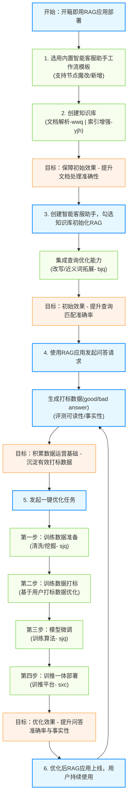
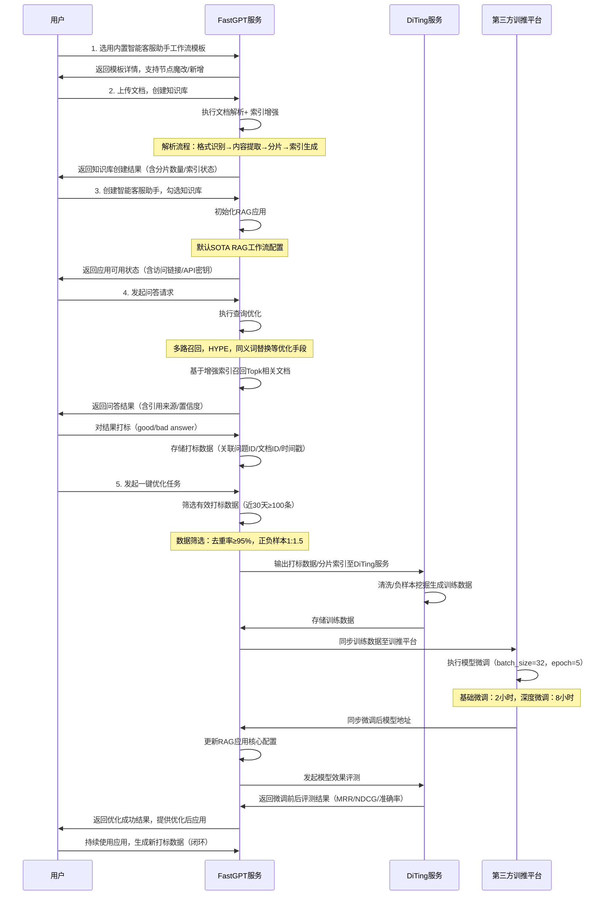
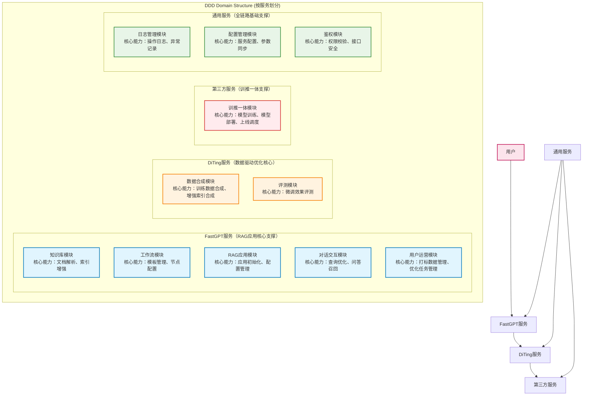
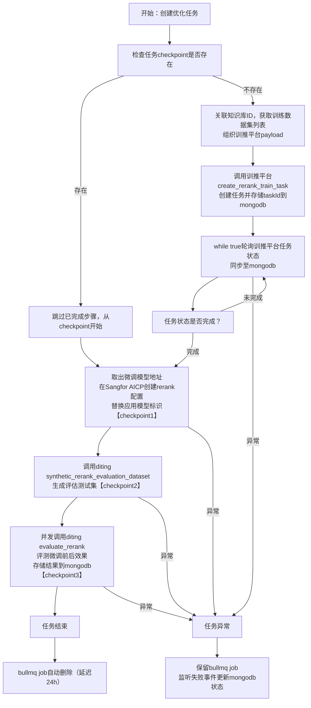

## 一、需求背景
在企业数字化转型进程中，智能客服助手作为高效的客户服务工具，其响应准确性与交互体验直接影响客户满意度及企业服务效率。传统客服系统存在依赖人工维护知识库、响应延迟、答案一致性差等痛点，而基于检索增强生成（RAG）技术的智能客服助手虽能缓解部分问题，但仍面临**初始效果不稳定、数据迭代优化流程不闭环、人工介入成本高**等核心挑战。

为满足企业对「开箱即用、可动态优化」的智能客服解决方案的核心诉求，本项目聚焦构建标准化RAG应用体系，通过预置工作流模板、自动化数据处理、智能化模型微调及闭环运营机制，实现智能客服助手的快速部署与持续效果提升，支撑企业客户服务场景的规模化、高效化运转。

## 二、业务目标
### 核心目标：开箱即用的RAG应用部署与优化
1. **初始效果达标**
    - 准确率：首次部署后，智能客服对常见问题的回答准确率≥85%
    - 答案质量：答案逻辑清晰、无冗余信息，严格基于知识库事实，杜绝虚构内容
2. **数据运营驱动优化**
    - 微调效果：基于用户反馈数据的定向微调，单次优化后准确率提升≥5%
    - 数据打标：构建「自动化+人工辅助」打标体系，月均有效打标数据量增长≥30%

## 三、业务模型
1. **内置智能客服助手工作流模板**（支持工作流节点魔改/新增）
    - 核心节点：用户意图识别 → 查询优化 → 文档检索 → 答案生成 → 反馈收集
    - 可配置项：检索阈值、生成温度系数、知识库权重等核心参数
2. **用户创建知识库**（文档解析+索引增强）
    - 支持格式：PDF、Word、TXT、Markdown、Excel（表格内容结构化提取）
    - 性能表现：支持大规模文档存储，索引更新响应及时
3. **初始化RAG应用**（创建智能客服助手+勾选知识库）
    - 流程耗时：模板选择→知识库关联→模型配置→应用发布，操作流程简洁高效
    - 扩展能力：支持多知识库关联，可配置知识库权重分配
4. **应用使用与效果评测**
    - 打标入口：每个回答底部设置「有用/无用」按钮，支持文字评论补充
    - 评测维度：准确率、召回率、F1值、用户满意度评分（1-5星）
5. **一键优化应用效果**（微调算法+训推一体）
    - 触发条件：累计有效打标数据达到一定规模
    - 优化效率：支持基础微调与深度微调两种模式，满足不同优化需求

优化流程拆分：

阶段1 - 训练样本构建（tab1：基础正负样本生成；tab2：用户标注样本转换）

阶段2 - 一键优化（触发模型微调+效果评测）

## 四、能力地图
| 目标 | 能力 | 核心说明 | 负责人 | 归属服务 | 核心技术指标 |
| --- | --- | --- | --- | --- | --- |
| 初始效果 | 查询优化 | 问题改写、近义词拓展、多路查询召回 | bjq | FastGPT | 有效提升问题理解与文档召回效果 |
|  | 文档解析 | 多格式文档分片提取 | wwq | FastGPT | 保障多格式文档内容的精准提取 |
|  | 索引增强 | 分片索引生成、增强索引构建 | yjh | FastGPT | 确保索引构建高效、查询响应迅速 |
| 数据驱动优化 | 训练数据清洗/挖掘 | 微调数据准备、正负样本挖掘、打标数据标准化（QAC+Q'A'C'） | sjq | DiTing | 保障训练数据质量与有效样本覆盖 |
|  | 索引增强算法 | pair-wise索引数据合成算法 | sjq | DiTing | 确保索引有效提升召回率 |
|  | 训练算法 | 模型微调算法设计与实现 | sjq | 训推一体服务 | 实现模型效果显著提升与高效训练 |
|  | 训推平台 | 模型训练调度、部署上线 | sxc | 训推一体服务 | 保障模型稳定部署与持续可用 |


## 五、整体方案
### 5.1 业务流程总览



### 5.2 模块交互时序图



### 5.3 模块架构（按服务划分，贴合接口规范核心职责）



## 六、风险项与应对措施
| 风险点 | 决策结论 | 细节说明 | 核心应对措施 |
| --- | --- | --- | --- |
| 训练数据维护策略（存储/清理） | 由FastGPT统一维护 | 交互无展示需求 | 新增mongo collection |
| 平台数据转换为训练数据 | DiTing提供专属生成接口 | 需要支持两种生成方式：<br/>+ 从知识库索引生成<br/>+ 从用户打标数据生成 | 并发控制和重试机制 |
| 索引增强方案与数据格式 | 拓展pair-wise索引类型，对每个分片生成1*10的pair-wise索引 | 严格控制顺序，前5个为第一个相似问题的多维度观点，后5个为第二个相似问题的多维度管理 | 1.避免重复生成<br/>2.并发控制和重试机制 |
| 训练数据跨服务共享 | HTTP流传输 | 需保障跨服务数据传输的效率与安全 | 1. GZIP压缩减少带宽   2. HTTPS加密+请求签名验证 |
| 训练算法与训推平台打通逻辑 | 算法脚本内置，FastGPT发起任务 | 支持算法版本管理，可指定历史版本执行 | 状态实时同步+异常告警 |


## 七、模块接口规范
### 7.1 FastGPT服务接口
#### 7.1.1 知识库文档解析（新增Paire-wise索引）
##### 已有索引构建机制
FastGPT训练队列通过「MongoDB Change Streams + 定时任务」双重触发，核心流程：

1. 队列触发：监听`MongoDatasetTraining`集合插入操作 + 每分钟执行`startTrainingQueue()`
2. 消费者处理：按`TrainingModeEnum`分队列处理（向量化/问答生成/文档解析）
3. 索引生成：`formatIndexes`函数按200字/块分片，生成默认索引并向量化存储
4. 数据流转：用户数据 → 训练队列 → 分片/索引 → 向量数据库+ MongoDB

##### 拓展pair-wise索引逻辑
在`getDefaultIndex`函数中新增索引生成逻辑，调用DiTing`synthetic_pairewise_index`接口：

1. 输入处理：提取Q/A内容，标准化格式并过滤特殊字符
2. 服务调用：HTTP POST请求，超时15s，失败重试2次
3. 结果解析：接收10条索引，前5条关联相似问题1，后5条关联相似问题2
4. 存储格式：

```plain
{
  "text": "索引文本内容",
  "type": "pairewise",
  "dataId": "原始分片ID",
  "relatedQuestion": "关联相似问题",
  "perspective": "观点维度",
  "vector": [0.123, 0.456...],
  "createdAt": "2023-10-01T08:00:00Z"
}
```

5. 异常处理：调用失败时降级为默认索引，记录告警日志

#### 7.1.2 训练数据管理
**数据结构关系**

+ 训练数据和分片为同级关系
+ 训练集和知识库为同级关系
+ 训练任务可以引用一至多个训练集开启训练

**基础路径**：`/api/core/app/train/rerank/trainset`

##### 训练数据生成（指定应用）
+ URL：`$base_url/generate-from-app`
+ 方法：POST
+ 请求参数：

```plain
{
  "appId": "智能客服应用ID",
  "sampleSize": 1000, // 默认1000，最大5000
  "includeLabeledData": true // 是否包含用户打标数据
}
```

+ 处理流程：
    1. 创建bullmq异步任务（优先级normal）
    2. 分层抽样：按知识库权重分配，近30天数据占60%，打标bad answer必采（≥20%）
    3. 调用DiTing`synthetic_rerank_traindata`接口生成标准训练数据
    4. 存储至`mongodb-rerank_train_dataset`，校验必填字段（queryId/positiveDocId等）
+ 响应结果：

```plain
{
  "taskId": "训练数据生成任务ID",
  "status": "pending"
}
```

##### 训练数据删除（知识库级联）
+ 触发时机：用户删除知识库时自动触发
+ 处理逻辑：
    1. 查询该知识库关联的训练数据集ID
    2. 批量删除`mongodb-rerank_train_dataset`及向量数据库关联数据
    3. 记录删除日志，失败则加入重试队列（最多3次）

#### 7.1.3 应用优化任务管理
**基础路径**：`/api/core/app/train/rerank/task`

##### 创建优化任务
+ URL：`$base_url/create`
+ 方法：POST
+ 请求参数：

```plain
{
  "appId": "智能客服应用ID",
  "trainsetIds": ["数据集ID1", "数据集ID2"] // 可选，默认关联所有训练数据集
}
```

###### 核心流程（bullmq异步任务）



###### 流程说明：
1. **任务初始化**：创建bullmq异步任务，优先检查`mongodb-rerank_train_task`中是否存在checkpoint，存在则从断点续跑（保证可重入）；
2. **发起训练任务**：关联应用绑定的知识库ID，筛选训练数据集并组装payload，调用训推平台`create_rerank_train_task`接口，返回任务ID并存储至`mongodb-rerank_train_task`；
3. **状态轮询**：通过while true定时轮询训推平台任务状态，实时同步至MongoDB；
4. **模型配置更新**：训练完成后，提取微调模型地址，在Sangfor AICP渠道创建rerank模型配置，替换应用内rerank模型标识（checkpoint1）；
5. **效果评测**：
    - 调用DiTing`synthetic_rerank_evaluation_dataset`生成评估测试集（checkpoint2）；
    - 并发调用DiTing`evaluate_rerank`接口，对比微调前后模型效果，将评测结果（MRR/NDCG/准确率）存储至`mongodb-rerank_train_task`（checkpoint3）；
6. **任务收尾**：成功完成后，bullmq job会延迟24小时自动删除；若中间步骤异常，保留bullmq job，监听失败事件并更新MongoDB中任务状态为「failed」，记录失败原因。
+ 响应结果：

```plain
{
  "taskId": "优化任务ID",
  "status": "running",
  "checkpoint": "train_complete",
  "checkpoint_data": {...}
}
```

##### 重试优化任务
+ URL：`$base_url/retry`
+ 方法：POST
+ 请求参数：

```plain
{
  "taskId": "优化任务ID"
}
```

+ 处理逻辑：验证任务状态为「failed」，调用`bullmq job.retry()`重置任务，从上次失败的checkpoint续跑。

##### 删除优化任务
+ URL：`$base_url/delete`
+ 方法：DELETE
+ 请求参数：

```plain
{
  "taskId": "优化任务ID"
}
```

+ 处理逻辑：终止bullmq job（若运行中），删除MongoDB任务记录，解除模型与应用的关联（保留模型文件）。

### 7.2 DiTing服务接口
| 接口名称 | 负责人 | 核心功能 | 入参核心字段 | 出参核心字段 |
| --- | --- | --- | --- | --- |
| synthetic_rerank_evaluation_dataset | sjq（待确认补充） | 生成rerank评估测试集 | 分片索引(pair-wise)集合、rerank openai url | rerank评估测试集（含query+相关文档等核心信息） |
| evaluate_rerank | sjq（待确认补充） | 评测rerank模型（无llm参数，hit rate计算较快） | 评估数据集、rerank openai url | 评测结果（含mrr、ndcg@5、hitRate@10、accuracy等） |
| synthetic_pairewise_index | sjq（待确认补充） | 生成pair-wise索引 | 原始分片数据 | 分片对应的pair-wise索引（单分片对应10条索引） |
| synthetic_rerank_traindata | sjq（待确认补充） | 生成rerank训练数据集 | 分片索引(pair-wise)集合、llm openai url | 标准训练数据集（含message、positive、negative核心字段） |


### 7.3 第三方训推平台接口
| 接口名称 | 负责人 | 核心功能 | 入参核心字段 | 出参核心字段 |
| --- | --- | --- | --- | --- |
| create_rerank_train_task | sxj（待确认补充） | 发起rerank训练任务 | rerank训练数据集 | 任务id |
| get/list_rerank_train_task | sxj（待确认补充） | 查询rerank训练任务状态 | 任务id（可选，为空时查询任务列表） | 任务状态/任务列表；success状态任务需包含微调后的模型地址，失败状态需包含错误信息 |

