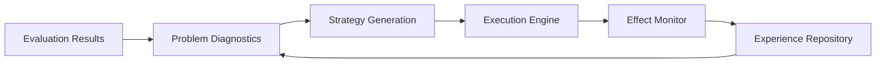
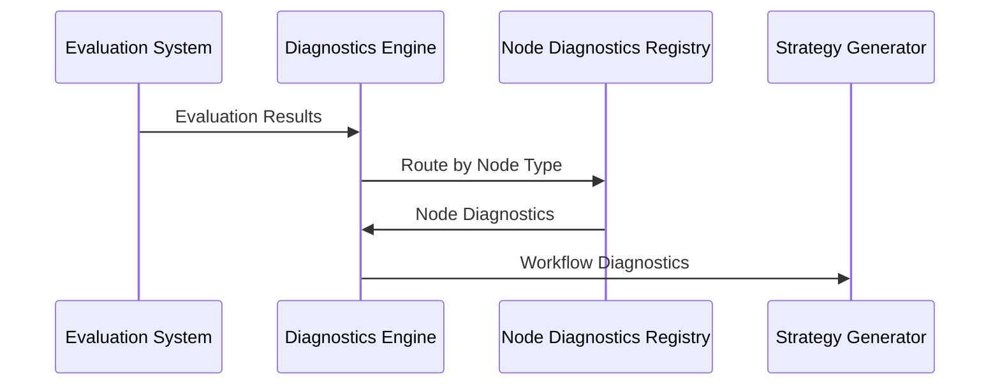
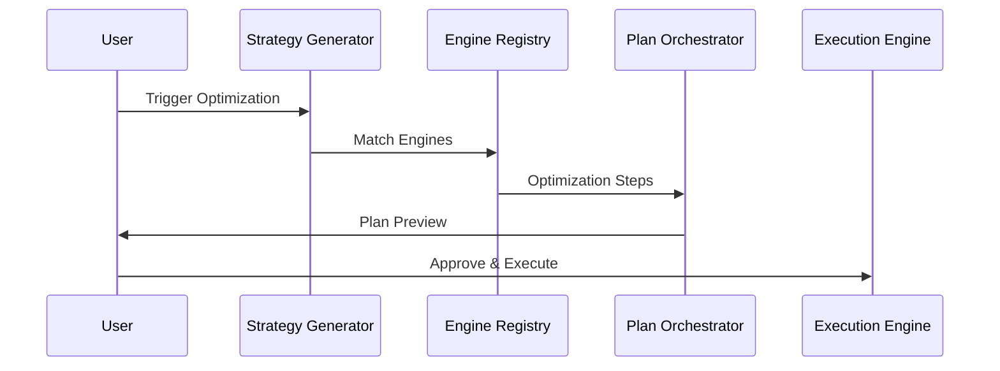

# Design: Evaluation-Driven Optimizer

## System Architecture

The evaluation-driven optimizer implements a four-stage pipeline with clear separation of concerns:



## Component Architecture

### 1. Problem Diagnostics Engine

**Purpose**: Convert evaluation results into structured problem diagnoses

**Key Design Decisions**:
- **Node-Type Registry Pattern**: Extensible diagnostics engines for different workflow node types
- **Standardized Output Format**: Consistent `WorkflowDiagnostics` and `NodeDiagnostics` interfaces
- **Multi-Dimensional Analysis**: Performance, quality, cost, and reliability metrics
- **Baseline Comparison**: Historical data comparison for anomaly detection

**Trade-offs**:
- **Extensibility vs Complexity**: Registry pattern adds complexity but enables future node type support
- **Accuracy vs Speed**: Comprehensive analysis trades speed for diagnostic accuracy

### 2. Strategy Generator

**Purpose**: Transform diagnoses into executable optimization plans

**Key Design Decisions**:
- **Engine Registry Architecture**: Similar to diagnostics, with pluggable optimization engines per node type
- **Plan Orchestration**: Handles complex multi-node optimization with dependency resolution
- **User Interaction Model**: Two-stage approval (problem confirmation + plan approval)
- **Atomic Planning**: All-or-nothing execution plans with comprehensive rollback

**Trade-offs**:
- **User Control vs Automation**: Manual approval ensures safety but reduces automation benefits
- **Plan Complexity vs Execution Risk**: Complex multi-node plans offer better optimization but higher failure risk

### 3. Execution Engine

**Purpose**: Safely apply optimization strategies with full recoverability

**Key Design Decisions**:
- **Step-by-Step Execution**: Individual step validation and rollback capability
- **Configuration Management**: Atomic configuration changes with backup/restore
- **Real-time Monitoring**: Continuous status tracking and error detection
- **Rollback Strategies**: Both immediate and deferred rollback options

**Trade-offs**:
- **Safety vs Performance**: Extensive validation and backup adds overhead but ensures reliability
- **Granular Control vs Simplicity**: Step-level control increases complexity but improves failure recovery

### 4. Effect Monitor

**Purpose**: Measure optimization impact and provide feedback for learning

**Key Design Decisions**:
- **Continuous Monitoring**: Long-term effect tracking beyond immediate execution
- **Metric Collection**: Integration with evaluation system for before/after comparison
- **Learning Feedback**: Success/failure patterns fed back to diagnostics and strategy engines
- **Statistical Validation**: A/B testing framework for optimization effect validation

## Data Flow Architecture

### Problem Identification Flow


### Strategy Generation Flow


## Integration Architecture

### Evaluation System Integration
- **Input**: Structured evaluation results with node-level metrics
- **Requirements**: Evaluation metadata must include node execution details and performance metrics
- **Data Format**: JSON-based evaluation results with standardized metric naming

### Workflow System Integration
- **API Requirements**: Read/write access to workflow node configurations
- **Consistency**: Configuration versioning and atomic updates
- **Validation**: Workflow integrity validation after configuration changes

### AI Model Integration
- **Strategy Generation**: AI models for intelligent optimization recommendation
- **Diagnostics Enhancement**: AI-powered problem pattern recognition
- **Effect Analysis**: AI-driven optimization impact assessment

## Extensibility Design

### Node Type Extensibility
```typescript
interface NodeOptimizationEngine {
  nodeType: string;
  canOptimize(diagnostics: NodeDiagnostics): boolean;
  generateStrategy(context: OptimizationContext): OptimizationPlanStep[];
}

interface NodeDiagnosticsEngine {
  nodeType: string;
  diagnose(nodeConfig: any, nodeResults: any): NodeDiagnostics;
}
```

### Engine Registry Pattern
- **Registration**: Dynamic engine registration at runtime
- **Discovery**: Automatic engine discovery for installed node types
- **Versioning**: Engine versioning for backward compatibility
- **Configuration**: Engine-specific configuration and tuning parameters

## Scalability Considerations

### Performance Scaling
- **Parallel Diagnostics**: Multi-node parallel problem analysis
- **Async Strategy Generation**: Non-blocking strategy computation
- **Batch Execution**: Grouped configuration updates for efficiency
- **Cache Layer**: Optimization plan caching for similar workflow patterns

### Data Scaling
- **Incremental Processing**: Only re-analyze changed workflow components
- **Data Archival**: Automatic cleanup of old optimization history
- **Streaming Architecture**: Process large workflows in chunks
- **Memory Management**: Efficient memory usage for large optimization plans

## Security & Safety

### Configuration Safety
- **Atomic Transactions**: All-or-nothing configuration updates
- **Validation Checkpoints**: Multi-stage validation before, during, and after changes
- **Audit Trail**: Complete history of all configuration modifications
- **Permission Integration**: Respect existing workflow permission system

### Data Protection
- **Backup Strategy**: Automatic configuration backups before optimization
- **Encryption**: Sensitive optimization data encryption at rest
- **Access Control**: Role-based access to optimization features
- **Data Isolation**: Team-level optimization data separation

## Monitoring & Observability

### System Health Monitoring
- **Component Status**: Real-time health checks for all optimizer components
- **Performance Metrics**: Execution time, success rate, rollback frequency
- **Resource Usage**: Memory, CPU, and storage consumption tracking
- **Error Analytics**: Detailed error classification and trending

### Business Metrics
- **Optimization Effectiveness**: Before/after performance comparisons
- **User Adoption**: Optimization trigger frequency and success rates
- **ROI Measurement**: Cost vs. benefit analysis of optimizations
- **Quality Metrics**: Optimization accuracy and user satisfaction