# FastGPT Eval-Drived APP-Optimization-Agent Design (mvp)

## 1. 概述

### 1.1 背景
FastGPT优化Agent是基于评估结果的应用性能优化工具，当用户发现工作流评估结果不理想时，可以主动触发针对性的优化。遵循简单性原则，专注核心优化流程。

### 1.2 设计目标
- **自动化优化**: 基于评估结果自动识别并解决性能问题
- **引擎化扩展**: 支持不同场景的优化引擎(RAG、工作流、模型调优等)
- **安全执行**: 确保优化过程的安全性和可回滚性
- **持续学习**: 积累优化经验，提升后续效果

### 1.3 性能指标量化定义

| 指标名称 | 定义 | 测量方法 | 可接受范围 | 优秀阈值 |
|---------|------|----------|-----------|----------|
| **准确率** | 正确回答问题数 / 总问题数 | 基于评估数据集的准确率计算 | 85% - 100% | > 95% |
| **响应延迟** | 从用户请求到返回响应的时间 | P95延迟统计 | < 3000ms | < 1000ms |
| **用户满意度** | 用户对答案质量的主观评价 | 1-5分评分系统 | 4.0 - 5.0 | > 4.5 |
| **系统稳定性** | 系统连续稳定运行能力 | 错误率 + 可用性统计 | 可用性 > 99.9%, 错误率 < 1% | 可用性 > 99.99%, 错误率 < 0.1% |

## 2. 核心架构

### 2.1 系统架构图
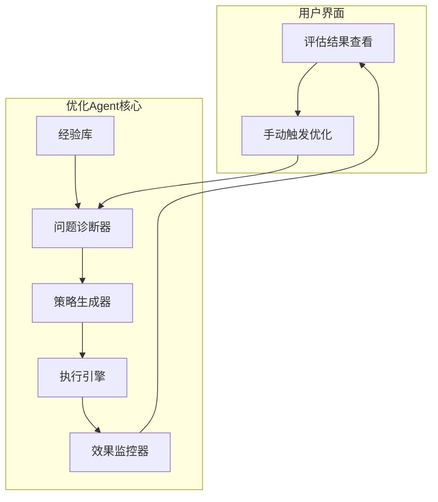

### 2.2 核心组件设计

#### 2.2.1 问题诊断器 (Problem Diagnostics Engine)

**设计目标**:
- 基于评估结果和工作流配置分析性能问题
- 识别具体的瓶颈节点和问题类型
- 为策略生成器提供准确的诊断信息

**系统架构**:
问题诊断器由以下核心组件构成：
- **WorkflowAnalyzer**: 工作流整体分析器
- **NodeDiagnosticsRegistry**: 节点诊断引擎注册表
- **MetricsAggregator**: 指标聚合器

**核心职责**:
| 功能 | 输入 | 输出 | 说明 |
|------|------|------|------|
| **工作流级分析** | 工作流配置 + 评估结果 | WorkflowDiagnostics | 识别整体性能问题和瓶颈节点 |
| **节点级诊断** | 节点配置 + 节点结果 | NodeDiagnostics | 对具体节点进行深度性能分析 |
| **标准化输出** | 原始指标数据 | 标准化诊断数据 | 生成统一格式的诊断数据 |
| **可扩展性支持** | 新节点类型 | 诊断能力扩展 | 支持新节点类型的诊断扩展 |

**节点诊断引擎**:
系统内置多种节点诊断引擎：
- `DatasetSearchDiagnosticsEngine`: 知识库搜索节点诊断
- `AiChatDiagnosticsEngine`: AI对话生成节点诊断  
- `HttpRequestDiagnosticsEngine`: HTTP请求节点诊断

**诊断维度**:
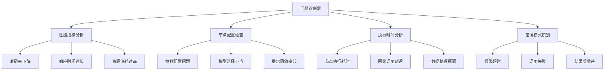

**运行流程**:
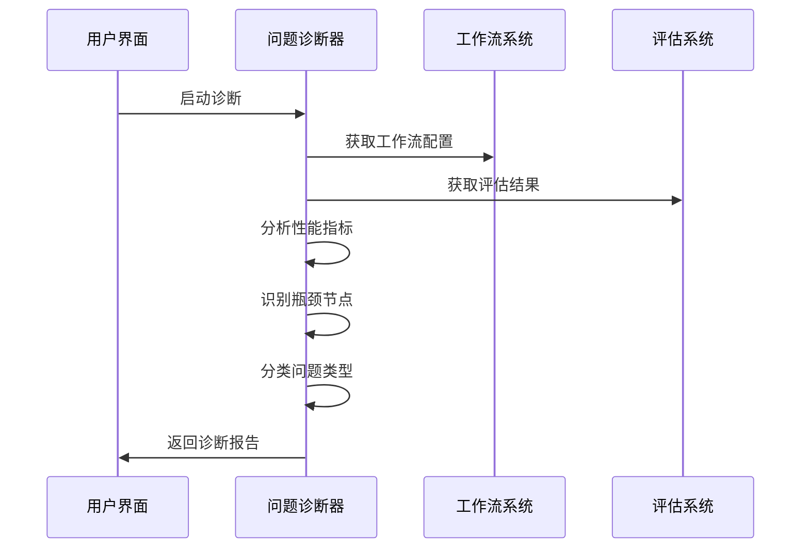

#### 2.2.2 策略生成器 (Strategy Generator)

**设计目标**:
- 基于诊断结果生成具体的优化策略
- 协调多个节点优化引擎并管理用户交互流程
- 生成可执行的优化计划

**系统架构**:
策略生成器由以下核心组件构成：
- **DiagnosticsAggregator**: 诊断结果汇总器
- **OptimizationEngineRegistry**: 优化引擎注册表
- **PlanOrchestrator**: 计划编排器
- **UserInteractionHandler**: 用户交互处理器

**核心职责**:
| 功能 | 输入 | 输出 | 说明 |
|------|------|------|------|
| **诊断结果分析** | WorkflowDiagnostics | 优化机会识别 | 解析问题诊断器输出的诊断数据 |
| **引擎匹配** | 节点类型 + 问题类型 | 匹配的引擎列表 | 根据节点类型匹配相应的优化引擎 |
| **计划编排** | OptimizationPlanStep[] | OptimizationPlan | 生成OptimizationPlan并处理依赖关系 |
| **用户交互** | 计划草案 + 用户反馈 | 最终计划 | 管理用户确认和计划修改流程 |
| **执行协调** | OptimizationPlan | 执行状态 | 与执行引擎协调优化计划的执行 |

**内置优化引擎**:
策略生成器内置多种节点优化引擎：
- `DatasetSearchOptimizationEngine`: 知识库搜索节点优化
- `AiChatOptimizationEngine`: AI对话生成节点优化
- `HttpRequestOptimizationEngine`: HTTP请求节点优化

**策略生成流程**:
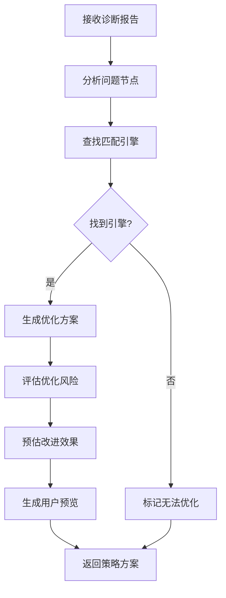

**执行计划表示**:
```typescript
interface OptimizationPlanStep {
  stepId: string;
  nodeId: string;
  engineId: string;
  configPatch: Record<string, any>;
  preconditions?: string[];
  metricsContext?: Record<string, number>;
}

interface OptimizationPlan {
  planId: string;
  scope: 'node-composed';
  steps: OptimizationPlanStep[];
  rollbackPolicy: 'all-or-nothing' | 'stepwise';
}
```

策略生成器将多节点问题拆解为若干`OptimizationPlanStep`，确保在不修改工作流拓扑的前提下，对多个节点的配置调整保持一次性事务特性。

**策略类型**:
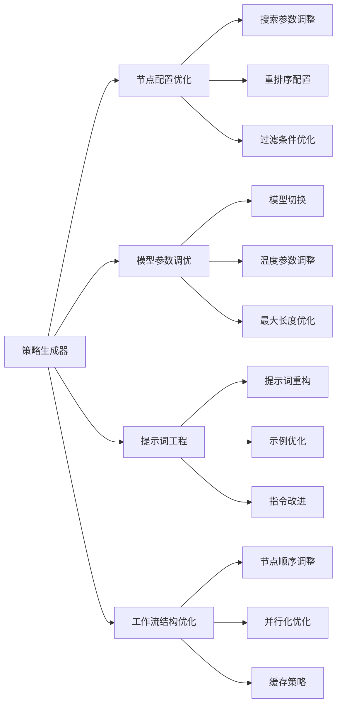

#### 2.2.3 执行引擎 (Execution Engine)

**设计目标**:
- 安全地执行优化策略
- 支持回滚和错误恢复
- 提供执行过程的实时监控

**核心职责**:
| 功能 | 输入 | 输出 | 说明 |
|------|------|------|------|
| **策略执行** | 优化策略方案 | 执行结果报告 | 安全地执行优化策略 |
| **计划解析** | 优化执行计划 | 执行上下文 | 解析Plan并协调多节点执行顺序 |
| **回滚点创建** | 应用ID | 回滚点信息 | 为安全回滚创建备份点 |
| **配置应用** | 配置变更列表 | 应用结果 | 逐步应用配置修改 |
| **效果验证** | 应用ID | 验证结果 | 验证修改后的功能正常性 |
| **回滚执行** | 回滚点信息 | 回滚结果 | 恢复到优化前的状态 |

**执行安全机制**:
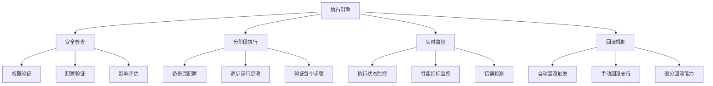

**执行流程**:
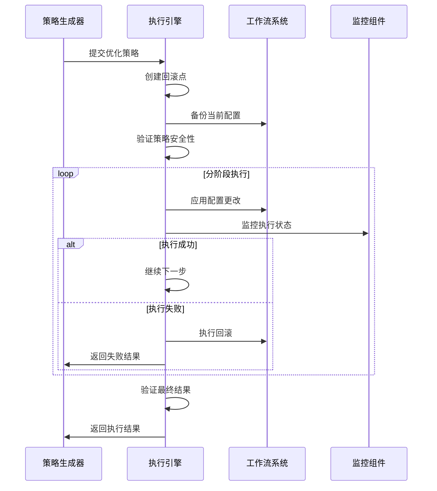

执行引擎按照`OptimizationPlan`的步骤顺序推进，支持全量回滚与分步回滚两种策略；当某一节点执行失败时，根据计划中的`rollbackPolicy`决定自动回滚范围，并将失败上下文反馈给策略生成器。

#### 2.2.4 效果监控器 (Effect Monitor)

**设计目标**:
- 监控优化后的系统性能
- 收集优化效果数据
- 触发后续的评估和学习

**核心职责**:
| 功能 | 输入 | 输出 | 说明 |
|------|------|------|------|
| **效果监控** | 执行ID + 基线数据 | 监控数据 | 持续监控优化后的效果 |
| **指标收集** | 应用ID | 性能指标数据 | 收集各项性能指标 |
| **报告生成** | 监控数据 | 效果分析报告 | 生成详细的效果分析 |
| **重新评估** | 应用ID | 评估任务 | 触发新一轮的评估验证 |
```

**监控维度**:
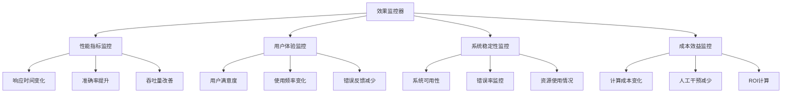

#### 2.2.5 经验库 (Experience Repository)

**设计目标**:
- 存储和管理优化经验
- 支持经验的查询和复用
- 提供学习和改进能力

**核心职责**:
| 功能 | 输入 | 输出 | 说明 |
|------|------|------|------|
| **经验保存** | 优化经验数据 | 保存状态 | 存储成功的优化经验 |
| **相似查询** | 问题模式 | 相似经验列表 | 查找相似的历史优化案例 |
| **成功率更新** | 策略ID + 成功标志 | 更新状态 | 更新策略的成功率统计 |
| **最佳实践** | 领域范围 | 实践建议列表 | 提取领域最佳优化实践 |
```

**经验学习流程**:
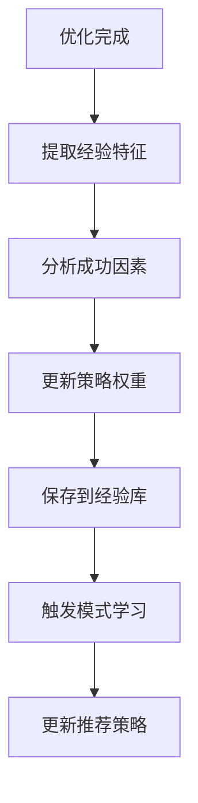

#### 2.2.6 用户触发优化流程
用户基于评估结果主动触发优化：

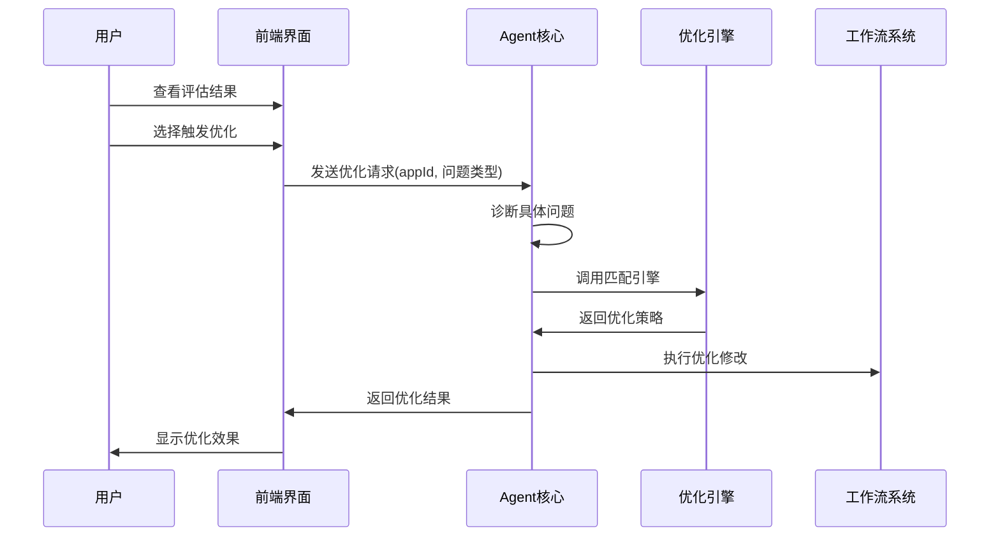

### 2.3 评估与指标采集扩展
- **指标补全**: 扩展评估系统，采集用户满意度、系统稳定性、响应时延等指标，输出结构化数据供策略生成器与效果监控器消费。
- **实时埋点**: 工作流执行结束后生成埋点事件，包含检索上下文、生成质量得分、错误类型等信息；由异步管线聚合统计。
- **基线同步**: 经验库保存每次优化后的基线指标，效果监控器对比新旧曲线，形成持续反馈闭环。
- **数据治理**: 支持指标定义版本化、采样策略配置，以及对敏感数据的脱敏处理，确保扩展后的评估能力可持续维护。

## 3. 数据流与接口标准

### 3.1 组件间数据传递标准

#### 3.1.1 诊断数据标准
问题诊断器与策略生成器之间的数据传递应遵循以下标准：

- **工作流诊断数据**: 包含工作流级别的健康状态、整体评分、瓶颈分析和节点诊断详情
- **节点诊断数据**: 包含节点ID、类型、状态、评分、指标容器、问题分类和建议操作
- **数据完整性**: 确保诊断数据包含足够信息供策略生成器进行引擎匹配和方案生成
- **标准化格式**: 所有诊断数据必须采用统一的结构化格式，便于不同组件处理

#### 3.1.2 优化计划标准
策略生成器与执行引擎之间的数据传递应遵循以下标准：

- **计划基本信息**: 包含计划ID、工作流ID、执行范围和创建时间
- **步骤定义标准**: 每个优化步骤必须包含节点ID、引擎ID、配置补丁和前置条件
- **回滚策略**: 明确定义回滚政策（全部回滚或分步回滚）
- **用户授权**: 记录用户对计划的批准状态，确保执行的合规性

#### 3.1.3 评估数据接入标准
优化Agent与评估系统之间的数据接入应遵循以下标准：

- **评估结果格式**: 标准化评估结果数据结构，包含指标名称、数值、基线对比和趋势信息
- **触发条件**: 明确定义何时从评估结果触发优化流程的条件和阈值
- **数据溯源**: 保持评估数据到优化决策的完整追溯链路
- **指标映射**: 建立评估指标与优化目标之间的标准映射关系

#### 3.1.4 效果反馈标准
效果监控器与经验库之间的数据反馈应遵循以下标准：

- **优化效果量化**: 标准化优化前后的效果对比数据格式
- **经验抽取**: 定义从优化过程中抽取可复用经验的数据结构
- **失败模式记录**: 标准化失败案例的记录格式，用于改进算法
- **持续学习**: 建立优化效果反馈到诊断算法改进的数据流标准

## 4. 核心流程

### 4.1 优化执行流程
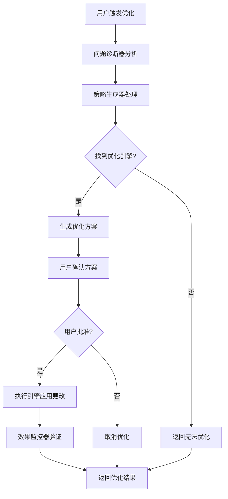

在`分析节点配置`与`生成节点优化方案`之间，策略生成器会构建`OptimizationPlan`，记录多节点步骤及依赖关系，并在用户确认后连同方案一并交给执行引擎。

### 4.2 经验学习机制


## 5. 关键特性

### 5.1 安全执行
- **回滚机制**: 每次优化前创建回滚点
- **渐进式执行**: 分步执行复杂优化
- **影响评估**: 预评估优化的潜在影响

### 5.2 效果验证
- **A/B测试**: 自动设计对比实验
- **统计显著性**: 验证改进的统计意义
- **长期监控**: 跟踪优化的持续效果

### 5.3 扩展性
- **引擎注册**: 支持新节点类型的优化引擎注册
- **配置驱动**: 通过简单配置调整优化行为

## 6. 部署架构

### 6.1 系统部署图
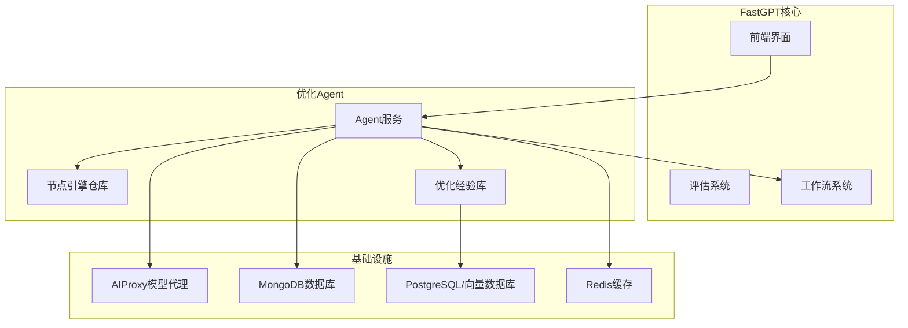

### 6.2 扩展机制
- **水平扩展**: 支持多实例负载均衡
- **垂直扩展**: 根据负载动态调整资源
- **边缘部署**: 支持靠近数据源的边缘部署

## 7. 监控与度量

### 7.1 关键指标
- **优化成功率**: 优化策略的成功执行比例
- **性能改进幅度**: 各项指标的平均提升程度
- **响应时间**: 从问题发现到优化完成的时间
- **回滚频率**: 需要回滚的优化比例

### 7.2 监控面板
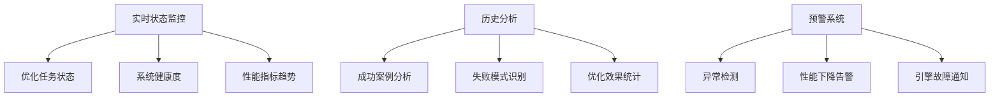

## 8. 实施规划

### 8.1 实施阶段
| 阶段 | 内容 | 优先级 | 预期周期 |
|------|------|--------|----------|
| **阶段1** | 核心框架 + 问题诊断器 | 高 | 2-3周 |
| **阶段2** | 策略生成器 + 执行引擎 | 高 | 3-4周 |
| **阶段3** | 第一批引擎(dataset-search, ai-chat) | 中 | 4-5周 |
| **阶段4** | 效果监控 + 经验库 | 中 | 2-3周 |
| **阶段5** | 更多引擎 + 高级特性 | 低 | 持续迭代 |

### 8.2 技术依赖
- **前置条件**: 评估系统完善、工作流系统稳定
- **基础设施**: MongoDB、PostgreSQL、Redis、AIProxy
- **人力要求**: 2-3名后端开发、1名前端开发、1名测试

## 9. 最佳实践

### 9.1 设计原则应用
- **KISS原则**: 简化接口设计，避免过度抽象
- **用户控制**: 用户主动触发，完全掌控优化时机
- **单一职责**: 每个引擎专注特定类型的优化问题
- **开闭原则**: 对扩展开放，对修改封闭

### 9.2 实施建议
- **用户驱动**: 优化由用户主动触发，避免意外修改
- **可视化策略**: 向用户展示优化策略，获得确认后执行
- **安全第一**: 确保所有优化操作可回滚
- **渐进优化**: 支持分步骤优化，每步都可以停止

## 10. 总结

本设计通过用户触发机制和引擎化扩展，实现了简洁而强大的优化Agent系统。核心特点：

1. **简单性**: 遵循KISS原则，接口简洁明了
2. **用户控制**: 用户主动触发，完全掌控优化过程  
3. **模块化**: 诊断器、策略生成器、执行引擎各司其职
4. **可扩展**: 引擎化架构支持新节点类型的优化能力扩展
5. **安全性**: 完整的回滚和验证机制
6. **可视化**: 向用户展示优化策略和预期效果

该架构为FastGPT应用的用户主导优化提供了坚实的技术基础，确保优化过程的可控性和安全性。