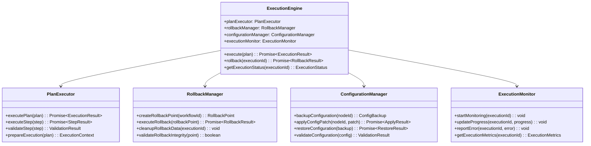
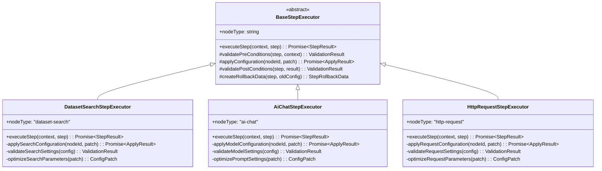
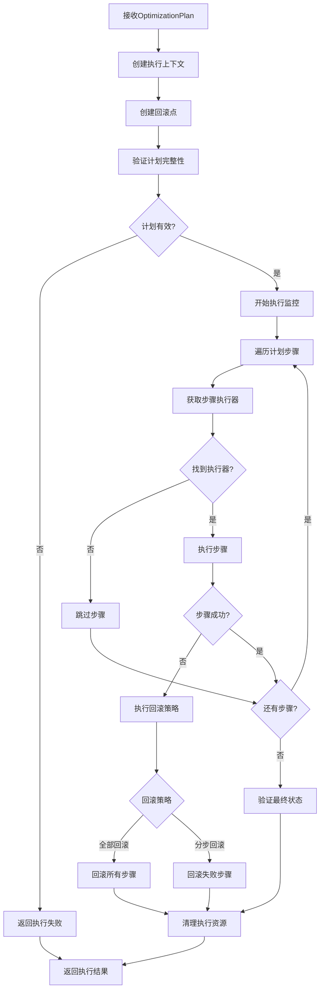
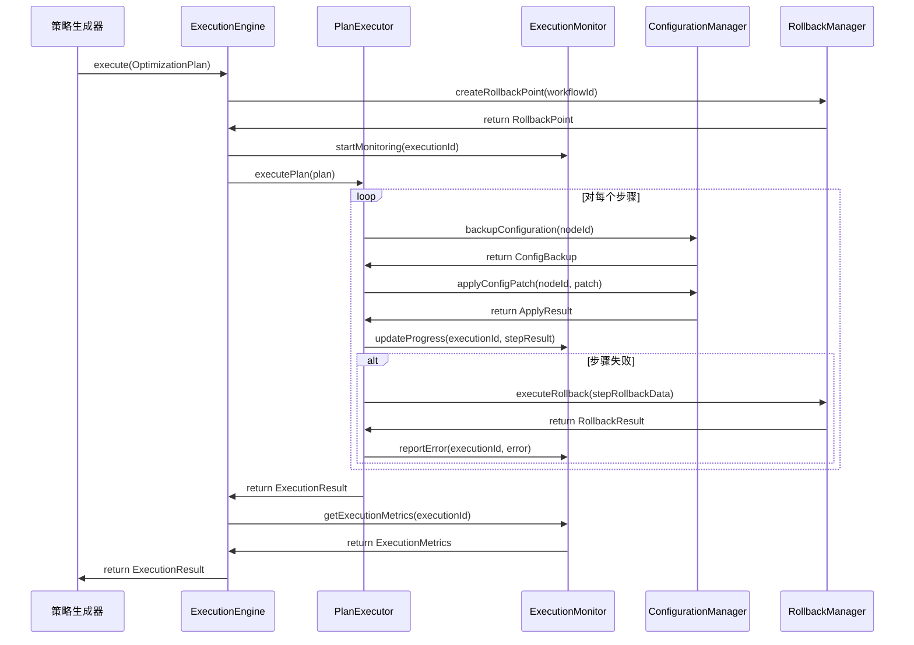

# 执行引擎设计文档

## 1. 概述

### 1.1 设计目标
执行引擎是优化Agent系统的核心执行组件，负责安全地执行优化策略、管理回滚机制、提供执行过程的实时监控，确保优化操作的可靠性和可恢复性。

### 1.2 核心职责
- **策略执行**: 安全地执行OptimizationPlan中的各个步骤
- **回滚管理**: 创建回滚点并在失败时自动恢复
- **执行监控**: 实时监控执行状态和进度
- **配置管理**: 原子性地应用和回滚配置变更

## 2. 系统架构

### 2.1 整体架构


### 2.2 数据结构定义

#### 2.2.1 核心执行接口
```typescript
interface ExecutionResult {
  executionId: string;
  planId: string;
  status: 'success' | 'partial_success' | 'failed' | 'rolled_back';
  executedSteps: StepResult[];
  failedSteps: StepResult[];
  rollbackPoint?: RollbackPoint;
  executionMetrics: ExecutionMetrics;
  errorDetails?: ExecutionError[];
  executionTimestamp: Date;
  completionTimestamp?: Date;
}

interface StepResult {
  stepId: string;
  nodeId: string;
  engineId: string;
  status: 'pending' | 'executing' | 'success' | 'failed' | 'skipped';
  startTime: Date;
  endTime?: Date;
  appliedChanges: ConfigChange[];
  rollbackData: StepRollbackData;
  validationResult?: ValidationResult;
  errorMessage?: string;
}

interface ExecutionContext {
  executionId: string;
  workflowId: string;
  plan: OptimizationPlan;
  rollbackPoint: RollbackPoint;
  executionStartTime: Date;
  stepExecutors: Map<string, StepExecutor>;
}
```

#### 2.2.2 回滚与配置管理
```typescript
interface RollbackPoint {
  rollbackId: string;
  workflowId: string;
  creationTime: Date;
  configurationBackups: Map<string, ConfigBackup>;
  executionContext: ExecutionSnapshot;
  integrityHash: string;
}

interface ConfigBackup {
  nodeId: string;
  nodeType: string;
  originalConfig: Record<string, any>;
  backupTimestamp: Date;
  configVersion: string;
  backupMetadata: BackupMetadata;
}

interface ConfigChange {
  changeId: string;
  nodeId: string;
  property: string;
  oldValue: any;
  newValue: any;
  changeTimestamp: Date;
  changeType: 'add' | 'update' | 'delete';
}
```

## 3. 步骤执行器

### 3.1 步骤执行器架构


### 3.2 步骤执行器实现
```typescript
abstract class BaseStepExecutor {
  abstract nodeType: string;
  
  async executeStep(context: ExecutionContext, step: OptimizationPlanStep): Promise<StepResult> {
    const stepResult: StepResult = {
      stepId: step.stepId,
      nodeId: step.nodeId,
      engineId: step.engineId,
      status: 'pending',
      startTime: new Date(),
      appliedChanges: [],
      rollbackData: { originalConfig: {}, changeLog: [] }
    };
    
    try {
      // 1. 验证前置条件
      const preValidation = this.validatePreConditions(step, context);
      if (!preValidation.isValid) {
        stepResult.status = 'failed';
        stepResult.errorMessage = `Pre-condition validation failed: ${preValidation.errors.join(', ')}`;
        return stepResult;
      }
      
      // 2. 备份当前配置
      const configBackup = await this.backupNodeConfiguration(step.nodeId);
      stepResult.rollbackData = this.createRollbackData(step, configBackup);
      
      // 3. 应用配置变更
      stepResult.status = 'executing';
      const applyResult = await this.applyConfiguration(step.nodeId, step.configPatch);
      stepResult.appliedChanges = applyResult.changes;
      
      // 4. 验证后置条件
      const postValidation = this.validatePostConditions(step, stepResult);
      if (!postValidation.isValid) {
        // 自动回滚
        await this.rollbackStep(stepResult);
        stepResult.status = 'failed';
        stepResult.errorMessage = `Post-condition validation failed: ${postValidation.errors.join(', ')}`;
        return stepResult;
      }
      
      stepResult.status = 'success';
      stepResult.endTime = new Date();
      
    } catch (error) {
      stepResult.status = 'failed';
      stepResult.errorMessage = error.message;
      stepResult.endTime = new Date();
      
      // 尝试回滚
      try {
        await this.rollbackStep(stepResult);
      } catch (rollbackError) {
        stepResult.errorMessage += ` (Rollback also failed: ${rollbackError.message})`;
      }
    }
    
    return stepResult;
  }
  
  protected abstract validatePreConditions(step: OptimizationPlanStep, context: ExecutionContext): ValidationResult;
  protected abstract applyConfiguration(nodeId: string, patch: Record<string, any>): Promise<ApplyResult>;
  protected abstract validatePostConditions(step: OptimizationPlanStep, result: StepResult): ValidationResult;
  
  protected createRollbackData(step: OptimizationPlanStep, backup: ConfigBackup): StepRollbackData {
    return {
      stepId: step.stepId,
      nodeId: step.nodeId,
      originalConfig: backup.originalConfig,
      changeLog: [],
      rollbackTimestamp: new Date()
    };
  }
}
```

## 4. 执行流程

### 4.1 完整执行流程


### 4.2 执行监控序列图


## 5. 扩展机制

### 5.1 新节点类型支持
```typescript
// 添加新节点类型的执行支持
class CustomNodeStepExecutor extends BaseStepExecutor {
  nodeType = "custom-node";
  
  protected validatePreConditions(step: OptimizationPlanStep, context: ExecutionContext): ValidationResult {
    // 自定义前置条件验证逻辑
    return { isValid: true, errors: [] };
  }
  
  protected async applyConfiguration(nodeId: string, patch: Record<string, any>): Promise<ApplyResult> {
    // 自定义配置应用逻辑
    return {
      success: true,
      changes: [],
      appliedAt: new Date()
    };
  }
  
  protected validatePostConditions(step: OptimizationPlanStep, result: StepResult): ValidationResult {
    // 自定义后置条件验证逻辑
    return { isValid: true, errors: [] };
  }
}

// 注册新的步骤执行器
executionEngine.registerStepExecutor("custom-node", new CustomNodeStepExecutor());
```

### 5.2 执行策略配置
```typescript
interface ExecutionConfig {
  maxRetryAttempts: number;
  stepTimeout: number;
  rollbackPolicy: 'immediate' | 'defer' | 'manual';
  parallelExecution: boolean;
  validationLevel: 'basic' | 'strict' | 'comprehensive';
  monitoringInterval: number;
}

interface RollbackConfig {
  autoRollbackOnFailure: boolean;
  rollbackTimeout: number;
  preservePartialChanges: boolean;
  rollbackValidation: boolean;
}
```

## 6. 监控与度量

### 6.1 执行性能监控
- **执行时间追踪**: 记录每个步骤和整体计划的执行时间
- **资源使用监控**: 监控内存、CPU使用情况
- **错误率统计**: 统计步骤失败率和回滚频率
- **配置变更审计**: 记录所有配置变更的完整日志

### 6.2 监控指标
```typescript
interface ExecutionMetrics {
  totalExecutionTime: number;
  successfulSteps: number;
  failedSteps: number;
  rollbackOperations: number;
  configurationChanges: number;
  averageStepTime: number;
  peakMemoryUsage: number;
  errorRate: number;
}
```

## 7. 错误处理与恢复

### 7.1 错误分类与处理
- **配置错误**: 无效的配置补丁，自动跳过并记录
- **执行超时**: 步骤执行超时，触发强制终止和回滚
- **依赖失败**: 前置条件不满足，暂停执行并等待修复
- **系统异常**: 底层系统错误，触发全量回滚

### 7.2 恢复策略
```typescript
interface RecoveryStrategy {
  errorType: 'config_error' | 'timeout' | 'dependency_failure' | 'system_error';
  action: 'retry' | 'skip' | 'rollback' | 'abort';
  maxRetries: number;
  retryDelay: number;
  escalationPolicy: EscalationLevel;
}
```

## 8. 与其他组件的集成

### 8.1 与策略生成器的集成
- 接收标准化的`OptimizationPlan`数据
- 返回详细的`ExecutionResult`和执行状态
- 支持执行状态的实时查询和监控

### 8.2 与效果监控器的集成
- 提供执行完成通知和结果数据
- 支持执行效果的后续追踪
- 记录优化前后的配置快照

### 8.3 与工作流系统的集成
- 通过标准API进行节点配置的读取和修改
- 确保工作流运行时的配置一致性
- 支持工作流的热更新和版本管理

## 9. 性能优化

### 9.1 执行优化
- **并行执行**: 支持无依赖步骤的并行执行
- **批量操作**: 对同类型节点进行批量配置更新
- **增量应用**: 仅应用实际变更的配置项
- **缓存机制**: 缓存配置验证结果和回滚数据

### 9.2 资源管理
- **连接池**: 复用与工作流系统的连接
- **内存优化**: 及时清理执行上下文和临时数据
- **磁盘管理**: 定期清理过期的回滚数据

## 10. 总结

执行引擎作为优化Agent系统的核心执行组件，提供了：

1. **可靠的执行框架**: 支持多种节点类型的标准化执行
2. **完善的回滚机制**: 确保执行失败时的快速恢复
3. **实时监控能力**: 提供执行过程的全程可观测性
4. **灵活的扩展性**: 易于添加新节点类型的执行支持
5. **高性能处理**: 支持大规模工作流的高效执行

该设计确保了执行系统的可靠性、可恢复性和可扩展性，为整个优化Agent系统提供了坚实的执行保障。