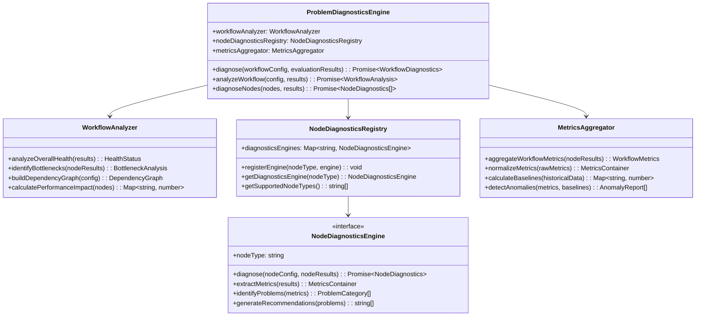
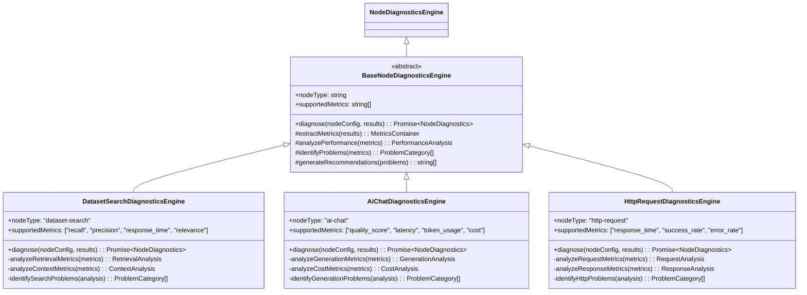
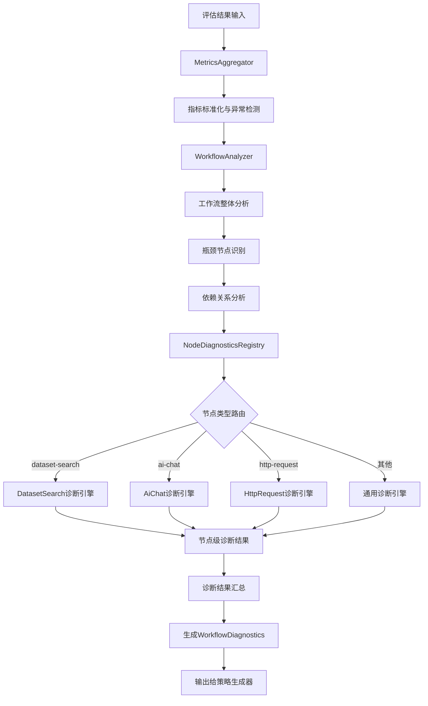
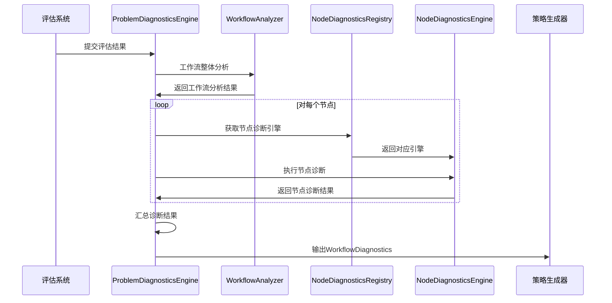

# 问题诊断器设计文档

## 1. 概述

### 1.1 设计目标
问题诊断器是优化Agent系统的核心组件，负责分析工作流执行结果和评估数据，识别性能瓶颈和问题节点，为策略生成器提供准确的诊断信息。

### 1.2 核心职责
- **工作流级分析**: 识别整体性能问题和瓶颈节点
- **节点级诊断**: 对具体节点进行深度性能分析
- **标准化输出**: 生成统一格式的诊断数据
- **可扩展性**: 支持新节点类型的诊断扩展

## 2. 系统架构

### 2.1 整体架构


### 2.2 数据结构定义

#### 2.2.1 核心诊断接口
```typescript
interface WorkflowDiagnostics {
  workflowId: string;
  overallHealth: HealthStatus;
  overallScore: number; // 0-100
  nodeDiagnostics: Record<string, NodeDiagnostics>;
  bottlenecks: BottleneckAnalysis;
  recommendedActions: WorkflowRecommendation[];
  diagnosticsTimestamp: Date;
}

interface NodeDiagnostics {
  nodeId: string;
  nodeType: string; // 'dataset-search' | 'ai-chat' | 'http-request' | ...
  status: 'healthy' | 'degraded' | 'failed';
  overallScore: number; // 0-100
  metrics: MetricsContainer;
  problemCategories: ProblemCategory[];
  failurePatterns: FailurePattern[];
  recommendedActions: string[];
  diagnosticsTimestamp: Date;
}

interface MetricsContainer {
  data: Record<string, MetricValue>;
  hasAnomalies(): boolean;
}

interface MetricValue {
  value: number;
  baseline?: number;
  threshold?: number;
  status: 'normal' | 'warning' | 'critical';
  trend?: number;
  category: string; // 'performance' | 'quality' | 'cost' | 'reliability'
  unit?: string;
  description?: string;
}
```

#### 2.2.2 分析结果结构
```typescript
interface BottleneckAnalysis {
  criticalNodes: string[];
  performanceImpact: Map<string, number>;
  rootCauseChain: CausalRelation[];
  priorityOrder: string[];
  impactSeverity: 'low' | 'medium' | 'high' | 'critical';
}

interface ProblemCategory {
  category: 'performance' | 'quality' | 'reliability' | 'cost' | 'security';
  severity: 'low' | 'medium' | 'high' | 'critical';
  description: string;
  affectedMetrics: string[];
  potentialCauses: string[];
}

interface FailurePattern {
  patternId: string;
  patternType: 'timeout' | 'error_rate' | 'quality_drop' | 'cost_spike';
  frequency: number;
  lastOccurrence: Date;
  description: string;
  suggestedActions: string[];
}
```

## 3. 节点诊断引擎

### 3.1 节点诊断引擎架构


### 3.2 节点诊断引擎实现
```typescript
abstract class BaseNodeDiagnosticsEngine implements NodeDiagnosticsEngine {
  abstract nodeType: string;
  abstract supportedMetrics: string[];
  
  async diagnose(nodeConfig: any, nodeResults: any): Promise<NodeDiagnostics> {
    const metrics = this.extractMetrics(nodeResults);
    const problems = this.identifyProblems(metrics);
    const failurePatterns = this.analyzeFailurePatterns(nodeResults);
    const recommendations = this.generateRecommendations(problems);
    
    return {
      nodeId: nodeConfig.nodeId,
      nodeType: this.nodeType,
      status: this.determineNodeStatus(problems),
      overallScore: this.calculateOverallScore(metrics, problems),
      metrics,
      problemCategories: problems,
      failurePatterns,
      recommendedActions: recommendations,
      diagnosticsTimestamp: new Date()
    };
  }
  
  protected abstract extractMetrics(results: any): MetricsContainer;
  protected abstract identifyProblems(metrics: MetricsContainer): ProblemCategory[];
  protected abstract generateRecommendations(problems: ProblemCategory[]): string[];
  
  protected determineNodeStatus(problems: ProblemCategory[]): 'healthy' | 'degraded' | 'failed' {
    const hasCritical = problems.some(p => p.severity === 'critical');
    const hasHigh = problems.some(p => p.severity === 'high');
    
    if (hasCritical) return 'failed';
    if (hasHigh) return 'degraded';
    return 'healthy';
  }
  
  protected calculateOverallScore(metrics: MetricsContainer, problems: ProblemCategory[]): number {
    let score = 100;
    
    problems.forEach(problem => {
      switch (problem.severity) {
        case 'critical': score -= 30; break;
        case 'high': score -= 20; break;
        case 'medium': score -= 10; break;
        case 'low': score -= 5; break;
      }
    });
    
    return Math.max(0, score);
  }
}
```

## 4. 诊断流程

### 4.1 完整诊断流程


### 4.2 诊断执行序列图


## 5. 扩展机制

### 5.1 新节点类型支持
```typescript
// 添加新节点类型的诊断支持
class CustomNodeDiagnosticsEngine extends BaseNodeDiagnosticsEngine {
  nodeType = "custom-node";
  supportedMetrics = ["custom_metric_1", "custom_metric_2"];
  
  protected extractMetrics(results: any): MetricsContainer {
    // 自定义指标提取逻辑
  }
  
  protected identifyProblems(metrics: MetricsContainer): ProblemCategory[] {
    // 自定义问题识别逻辑
  }
  
  protected generateRecommendations(problems: ProblemCategory[]): string[] {
    // 自定义建议生成逻辑
  }
}

// 注册新的诊断引擎
diagnosticsRegistry.registerEngine("custom-node", new CustomNodeDiagnosticsEngine());
```

### 5.2 配置驱动的诊断规则
```typescript
interface DiagnosticsConfig {
  nodeType: string;
  metricThresholds: Record<string, MetricThreshold>;
  problemDetectionRules: ProblemDetectionRule[];
  recommendationTemplates: RecommendationTemplate[];
}

interface MetricThreshold {
  warning: number;
  critical: number;
  baseline?: number;
  trend?: 'increasing' | 'decreasing' | 'stable';
}
```

## 6. 性能与监控

### 6.1 诊断性能优化
- **并行诊断**: 支持多节点并行诊断处理
- **缓存机制**: 缓存历史基线数据和常用诊断结果
- **增量诊断**: 仅对变更节点进行重新诊断
- **异步处理**: 支持大规模工作流的异步诊断

### 6.2 监控指标
```typescript
interface DiagnosticsMetrics {
  totalDiagnosticsRuns: number;
  averageDiagnosticsTime: number;
  nodeTypeDistribution: Record<string, number>;
  problemCategoryDistribution: Record<string, number>;
  diagnosisAccuracy: number; // 基于后续优化效果验证
}
```

## 7. 与其他组件的集成

### 7.1 与策略生成器的集成
- 输出标准化的`WorkflowDiagnostics`数据
- 提供清晰的问题分类和优先级排序
- 支持诊断结果的序列化和传输

### 7.2 与评估系统的集成
- 从评估结果中提取性能指标
- 支持多种评估数据格式
- 提供评估数据质量验证

### 7.3 与经验库的集成
- 记录诊断历史和准确性
- 学习和优化诊断规则
- 提供诊断结果的反馈循环

## 8. 总结

问题诊断器作为优化Agent系统的核心组件，提供了：

1. **统一的诊断架构**: 支持多种节点类型的标准化诊断
2. **可扩展的设计**: 易于添加新节点类型和诊断规则
3. **准确的问题识别**: 多维度的问题分析和分类
4. **清晰的数据接口**: 为策略生成器提供结构化的诊断数据
5. **高性能处理**: 支持大规模工作流的并行诊断

该设计确保了诊断系统的通用性和可维护性，为整个优化Agent系统提供了可靠的问题识别基础。