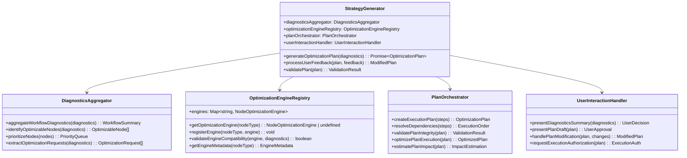
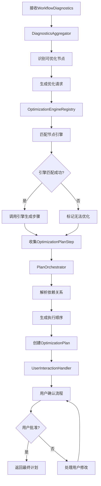
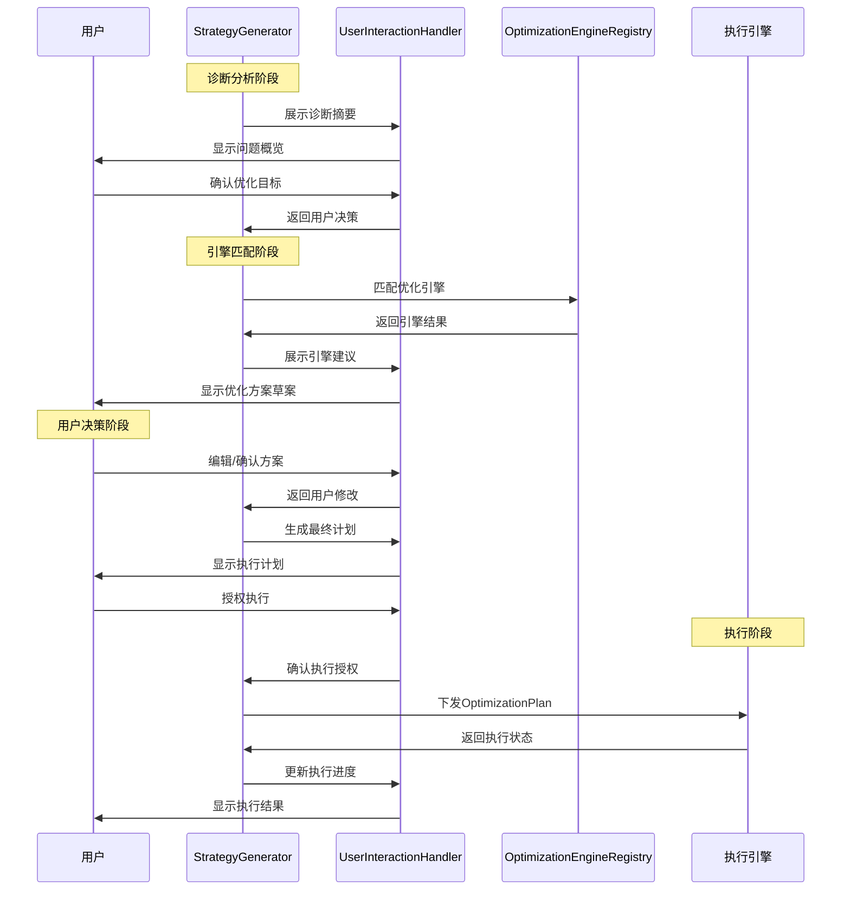
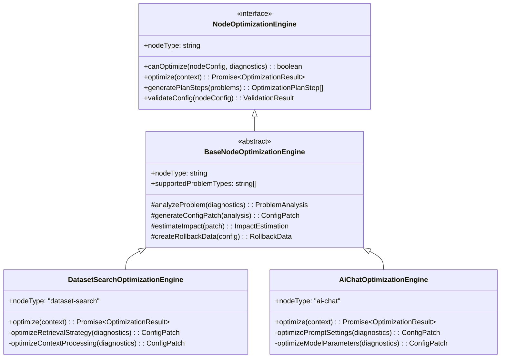
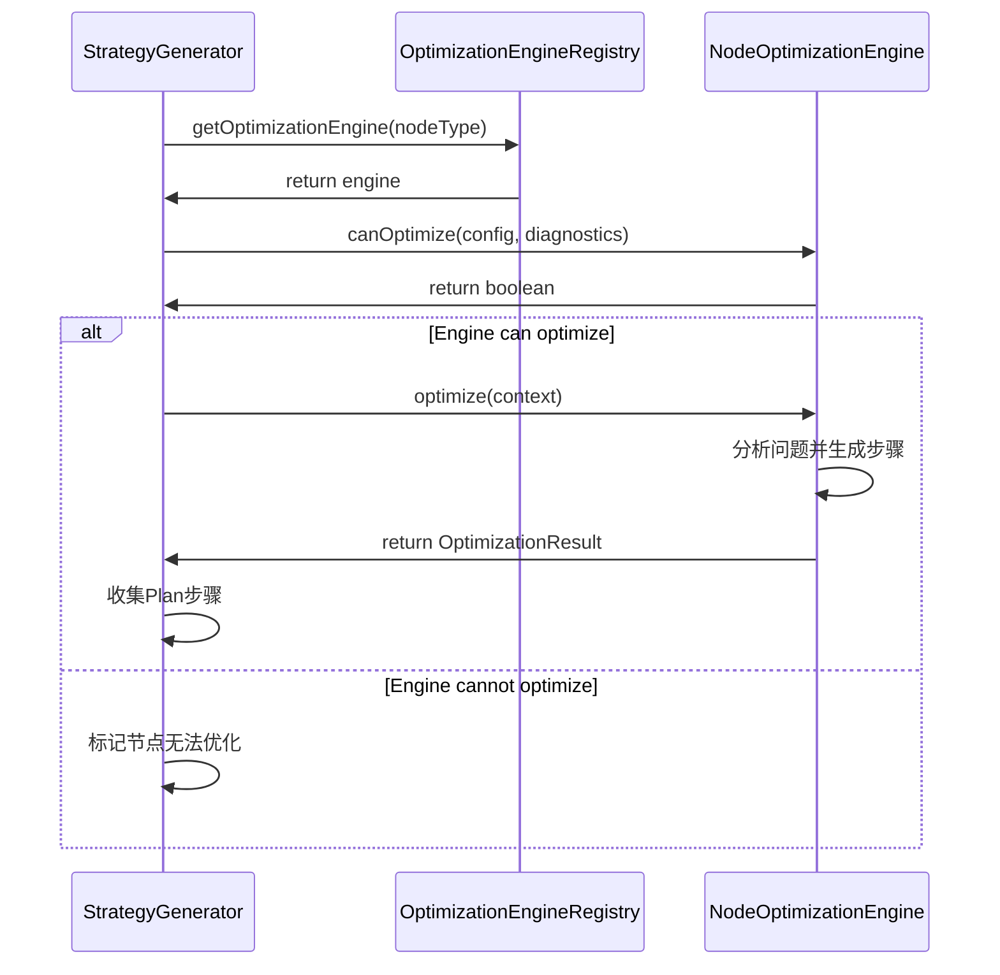

# 策略生成器设计文档

## 1. 概述

### 1.1 设计目标
策略生成器是优化Agent系统的核心编排组件，负责将问题诊断结果转换为可执行的优化计划，协调多个节点优化引擎，并管理用户交互流程。

### 1.2 核心职责
- **诊断结果分析**: 解析问题诊断器输出的诊断数据
- **引擎匹配**: 根据节点类型匹配相应的优化引擎
- **计划编排**: 生成OptimizationPlan并处理依赖关系
- **用户交互**: 管理用户确认和计划修改流程
- **执行协调**: 与执行引擎协调优化计划的执行

## 2. 系统架构

### 2.1 整体架构


### 2.2 核心数据结构
```typescript
interface OptimizationPlan {
  planId: string;
  workflowId: string;
  scope: 'node-composed';
  steps: OptimizationPlanStep[];
  rollbackPolicy: 'all-or-nothing' | 'stepwise';
  userApproved: boolean;
  createdAt: Date;
}

interface OptimizationPlanStep {
  stepId: string;
  nodeId: string;
  engineId: string;
  configPatch: Record<string, any>;
  preconditions?: string[];
  metricsContext?: Record<string, number>;
}

interface OptimizationRequest {
  nodeId: string;
  nodeType: string;
  problemCategories: ProblemCategory[];
  targetMetrics: string[];
  constraints: OptimizationConstraints;
  userPreferences: UserPreferences;
}
```

## 3. 核心流程

### 3.1 策略生成流程


### 3.2 用户交互流程


## 4. 关键组件设计

### 4.1 诊断汇总器
```typescript
class DiagnosticsAggregator {
  aggregateWorkflowDiagnostics(diagnostics: WorkflowDiagnostics): WorkflowSummary {
    return {
      overallHealth: diagnostics.overallHealth,
      criticalNodes: this.extractCriticalNodes(diagnostics),
      optimizationOpportunities: this.identifyOptimizationOpportunities(diagnostics),
      priorityOrder: this.calculatePriorityOrder(diagnostics),
      estimatedImpact: this.estimateOptimizationImpact(diagnostics)
    };
  }
  
  identifyOptimizableNodes(diagnostics: WorkflowDiagnostics): OptimizableNode[] {
    return Array.from(diagnostics.nodeDiagnostics.values())
      .filter(node => node.status !== 'healthy' || node.metrics.hasAnomalies())
      .map(node => this.createOptimizableNode(node));
  }
  
  private createOptimizableNode(nodeDiagnostics: NodeDiagnostics): OptimizableNode {
    return {
      nodeId: nodeDiagnostics.nodeId,
      nodeType: nodeDiagnostics.nodeType,
      problems: nodeDiagnostics.problemCategories,
      metrics: nodeDiagnostics.metrics,
      priority: this.calculateNodePriority(nodeDiagnostics),
      optimizationPotential: this.assessOptimizationPotential(nodeDiagnostics)
    };
  }
}
```

### 4.2 优化引擎注册表
```typescript
class OptimizationEngineRegistry {
  private engines = new Map<string, NodeOptimizationEngine>();
  private engineMetadata = new Map<string, EngineMetadata>();
  
  getOptimizationEngine(nodeType: string): NodeOptimizationEngine | undefined {
    return this.engines.get(nodeType);
  }
  
  registerEngine(nodeType: string, engine: NodeOptimizationEngine): void {
    this.engines.set(nodeType, engine);
    this.engineMetadata.set(nodeType, this.extractMetadata(engine));
  }
  
  validateEngineCompatibility(engine: NodeOptimizationEngine, diagnostics: NodeDiagnostics): boolean {
    return engine.canOptimize(null, diagnostics);
  }
  
  getEngineMetadata(nodeType: string): EngineMetadata | undefined {
    return this.engineMetadata.get(nodeType);
  }
  
  private extractMetadata(engine: NodeOptimizationEngine): EngineMetadata {
    return {
      nodeType: engine.nodeType,
      capabilities: this.analyzeEngineCapabilities(engine),
      supportedProblems: this.extractSupportedProblems(engine),
      estimatedEffectiveness: this.calculateEffectiveness(engine)
    };
  }
}
```

### 4.3 计划编排器
```typescript
class PlanOrchestrator {
  createExecutionPlan(steps: OptimizationPlanStep[]): OptimizationPlan {
    const dependencies = this.resolveDependencies(steps);
    const executionOrder = this.calculateExecutionOrder(steps, dependencies);
    const impact = this.estimatePlanImpact(steps);
    
    return {
      planId: this.generatePlanId(),
      workflowId: this.extractWorkflowId(steps),
      scope: this.determinePlanScope(steps),
      steps,
      executionOrder,
      dependencies,
      rollbackPolicy: this.selectRollbackPolicy(steps),
      estimatedDuration: this.calculateDuration(steps, executionOrder),
      estimatedImpact: impact,
      riskAssessment: this.assessRisk(steps, impact),
      userApproved: false,
      createdAt: new Date()
    };
  }
  
  resolveDependencies(steps: OptimizationPlanStep[]): DependencyMatrix {
    const matrix = new Map<string, string[]>();
    
    steps.forEach(step => {
      const dependencies = this.analyzePreconditions(step, steps);
      matrix.set(step.stepId, dependencies);
    });
    
    return matrix;
  }
  
  validatePlanIntegrity(plan: OptimizationPlan): ValidationResult {
    const issues: ValidationIssue[] = [];
    
    // 检查循环依赖
    if (this.hasCircularDependencies(plan.dependencies)) {
      issues.push({ type: 'circular_dependency', severity: 'critical' });
    }
    
    // 检查资源冲突
    const conflicts = this.detectResourceConflicts(plan.steps);
    issues.push(...conflicts);
    
    // 检查完整性
    const integrity = this.checkPlanCompleteness(plan);
    issues.push(...integrity);
    
    return {
      isValid: issues.length === 0,
      issues,
      warnings: this.generateWarnings(plan),
      suggestions: this.generateSuggestions(issues)
    };
  }
}
```

## 5. 优化引擎集成机制

### 5.0 引擎架构设计原则

优化引擎遵循与诊断引擎相同的设计模式，作为策略生成器的内部组件：



### 5.1 优化引擎调用流程


### 5.2 优化引擎输入输出标准化
```typescript
interface OptimizationContext {
  nodeConfig: any;
  diagnostics: NodeDiagnostics;
  userPreferences: UserPreferences;
  workflowContext: WorkflowContext;
}

interface OptimizationResult {
  success: boolean;
  planSteps: OptimizationPlanStep[];
  estimatedImpact: ImpactEstimation;
  rollbackData: RollbackData;
  warnings: string[];
  recommendations: string[];
}
```

## 6. 用户交互设计

### 6.1 交互决策点
1. **问题确认**: 用户确认问题诊断结果和需要优化的节点
2. **方案确认**: 用户预览并确认优化方案，一次性授权执行

### 6.2 用户控制能力
```typescript
interface UserPreferences {
  automationLevel: 'manual' | 'semi-auto' | 'full-auto';
  riskTolerance: 'conservative' | 'moderate' | 'aggressive';
  priorityFocus: 'performance' | 'cost' | 'reliability' | 'quality';
  maxExecutionTime: number;
  approvalRequired: boolean;
}

interface PlanModificationRequest {
  stepId: string;
  action: 'enable' | 'disable' | 'modify' | 'reorder';
  parameters?: Record<string, any>;
  newPriority?: 'low' | 'medium' | 'high' | 'critical';
}
```

## 7. 错误处理与回滚

### 7.1 错误处理策略
- **引擎错误**: 记录错误并标记节点为无法优化
- **依赖冲突**: 自动解决或提示用户选择
- **资源限制**: 调整计划或延迟执行
- **用户取消**: 保存草案并清理资源

### 7.2 回滚策略
```typescript
interface RollbackStrategy {
  policy: 'all-or-nothing' | 'stepwise' | 'best-effort';
  triggerConditions: RollbackCondition[];
  rollbackData: RollbackSnapshot;
  recoveryActions: RecoveryAction[];
}
```

## 8. 性能优化

### 8.1 并发处理
- **引擎并行调用**: 支持多引擎并发生成优化步骤
- **异步处理**: 大型计划的异步生成和验证
- **缓存机制**: 缓存引擎结果和依赖分析

### 8.2 内存管理
- **流式处理**: 大型工作流的流式策略生成
- **资源池**: 复用引擎实例和计算资源
- **垃圾回收**: 及时清理临时数据和缓存

## 9. 监控与度量

### 9.1 关键指标
```typescript
interface StrategyGeneratorMetrics {
  planGenerationTime: number;
  engineMatchSuccessRate: number;
  userApprovalRate: number;
  planExecutionSuccessRate: number;
  averagePlanComplexity: number;
  userInteractionTime: number;
}
```

### 9.2 质量评估
- **计划质量**: 基于执行结果评估计划质量
- **用户满意度**: 跟踪用户反馈和采纳率
- **优化效果**: 测量实际优化效果与预期的差异

## 10. 与其他组件的集成

### 10.1 与问题诊断器的集成
- 接收标准化的`WorkflowDiagnostics`数据
- 解析诊断结果并提取优化机会
- 反馈策略生成结果用于诊断准确性评估

### 10.2 与执行引擎的集成
- 输出标准化的`OptimizationPlan`
- 提供计划验证和完整性检查
- 支持执行状态的实时监控和反馈

### 10.3 与经验库的集成
- 记录策略生成历史和效果
- 学习用户偏好和优化模式
- 改进引擎匹配和计划生成算法

## 11. 总结

策略生成器作为优化Agent系统的核心编排组件，提供了：

1. **智能引擎匹配**: 基于节点类型和问题诊断的精准引擎选择
2. **灵活的计划编排**: 支持复杂依赖关系和执行顺序的计划生成
3. **用户友好的交互**: 多层级的用户控制和决策点
4. **可靠的错误处理**: 完善的错误处理和回滚机制
5. **高性能处理**: 支持大规模工作流的并发策略生成

该设计确保了策略生成系统的可扩展性、可靠性和用户体验，为整个优化Agent系统提供了强大的编排能力。